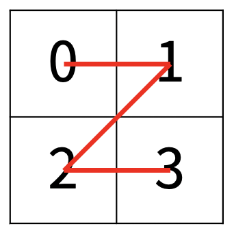
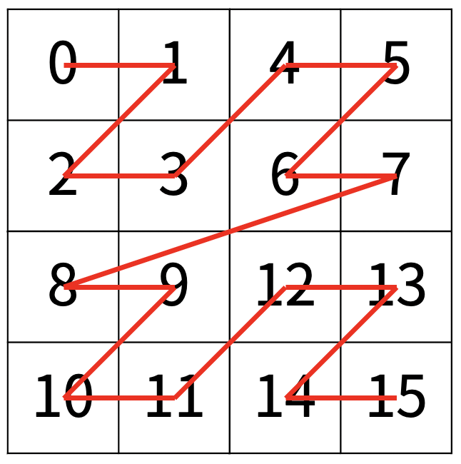
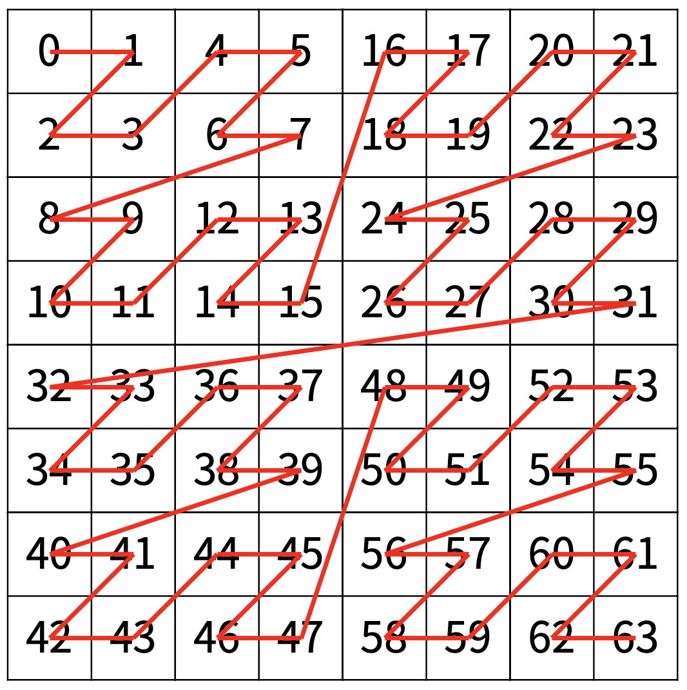

#  백준 1074 Z


### 풀이 언어 : C++

문제 구분 : #분할정복
#### [LINK - 백준 1074 Z](https://www.acmicpc.net/problem/1074)

### 문제
<hr>

한수는 크기가 2N × 2N인 2차원 배열을 Z모양으로 탐색하려고 한다. 예를 들어, 2×2배열을 왼쪽 위칸, 오른쪽 위칸, 왼쪽 아래칸, 오른쪽 아래칸 순서대로 방문하면 Z모양이다.

<center> </center>

N > 1인 경우, 배열을 크기가 $2^{N-1} × 2^{N-1}$로 4등분 한 후에 재귀적으로 순서대로 방문한다.

다음 예는 $2^2 × 2^2$ 크기의 배열을 방문한 순서이다.

<center>  </center>

N이 주어졌을 때, r행 c열을 몇 번째로 방문하는지 출력하는 프로그램을 작성하시오.

다음은 N=3일 때의 예이다.

<center>  </center>

### 입력
<hr>

첫째 줄에 정수 N, r, c가 주어진다.
### 출력
<hr>

r행 c열을 몇 번째로 방문했는지 출력한다.
### 풀이 이야기
<hr>

이 문제는 전체를 탐색하면서 내 숫자가 몇번인지 세기에는 $2^N$의 값이 너무 크기 때문에 시간 초과가 날 것이다. 따라서 굳이 셀 필요없는 구간은 수식의 계산을 거쳐서 단순 연산으로 PASS하는 것이 중요하다. 따라서 `Z`를 그릴 수 있는 4개의 구역을 나누어서 지속적으로 분할 정복을 하면 풀이할 수 있다.

```c++
    // 구역 나누기
    int half = size / 2;
    // (r, c)가 왼쪽 상단 구역에 존재
    if (y + half > r && x + half > c)
        solve(x, y, half);
    else // 아니면 PASS
        ret += half * half;
    // (r, c)가 오른쪽 상단 구역에 존재
    if (y + half > r && x + half <= c)
        solve(x + half, y, half);
    else // 아니면 PASS
        ret += half * half;
    ...
```
위 코드는 4개의 구역을 나누어 분할 정복하는 핵심 코드 중 일부이다. 4가지 구역을 나누는 기준은 (r, c)가 4개 구역 중에 어디에 존재하는지로 구분할 수 있다. 현재 Grid를 사등분 했을 때 (r, c)가 왼쪽 상단, 오른쪽 상단, 왼쪽 하단, 오른쪽 하단 중에 어디있는지는 좌표 값을 연산하여 알 수 있다. 만약 오른쪽 상단에 내가 원하는 (r, c)가 있다고 가정한다면, 오른쪽 상단 구역만 확인하면서 왼쪽 상단에 있는 모든 숫자는 PASS할 수 있게 된다. 따라서 단순히 왼쪽상단의 NxN 수를 더해주면서 오른쪽 상단의 구역만 관심있게 확인하면 된다.

```c++
    // (r, c) 위치에 도달했다면 정답 출력
    if (y == r && x == c && size == 1)
        std::cout << ret << std::endl;
    // 기저 사례 : 크기가 1인 사각형에 도달하면 Ret
    if (size <= 1) {
        ret += 1;
        return ;
    }
```
그럼 이 분할과정을 언제 까지 반복해야할까? 현재 구역의 크기가 1이 될때까지 반복하고 (r, c)에 도달했다면, 현재까지 몇번째 정보를 담고있는 `ret`을 출력해주면 된다.

### 풀이 코드
<hr>

``` c++
#include <iostream>
#include <math.h>

int N, r, c, ret; // 입출력 변수

void solve(int x, int y, int size) {
    // (r, c) 위치에 도달했다면 정답 출력
    if (y == r && x == c && size == 1)
        std::cout << ret << std::endl;
    // 기저 사례 : 크기가 1인 사각형에 도달하면 Ret
    if (size <= 1) {
        ret += 1;
        return ;
    }
    // 구역 나누기
    int half = size / 2;
    // (r, c)가 왼쪽 상단 구역에 존재
    if (y + half > r && x + half > c)
        solve(x, y, half);
    else // 아니면 PASS
        ret += half * half;
    // (r, c)가 오른쪽 상단 구역에 존재
    if (y + half > r && x + half <= c)
        solve(x + half, y, half);
    else // 아니면 PASS
        ret += half * half;
    // (r, c)가 왼쪽 하단 구역에 존재
    if (y + half <= r && x + half > c)
        solve(x, y + half, half);
    else // 아니면 PASS
        ret += half * half;
    // (r, c)가 오른쪽 하단 구역에 존재
    if (y + half <= r && x + half <= c)
        solve(x + half, y + half, half);
    else // 아니면 PASS
        ret += half * half;
}

int main(void) {
    // Input
    std::cin >> N >> r >> c;
    // Solve
    solve(0, 0, std::pow(2, N));
}
```
