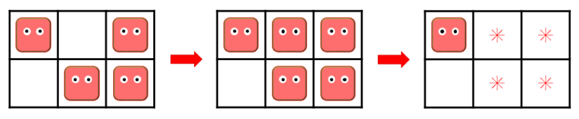

#  백준 14712 넴모넴모 (Easy)

문제 구분 : #백트래킹 #완전탐색 
#### [LINK - 백준 14712 넴모넴모 (Easy)](https://www.acmicpc.net/problem/14712)

### 문제
<hr>

네모는 뿌××× 게임에 깊은 감명을 받아, 직사각형 모양의 격자판과 “넴모”라는 수수께끼의 생물을 이용하는 “넴모넴모”라는 게임을 만들었다. 이 게임의 규칙은 아주 간단하다. 격자판의 비어 있는 칸을 임의로 골라 “넴모”를 하나 올려놓 거나, “넴모”가 올라간 칸 네 개가 2 × 2 사각형을 이루는 부분을 찾아 그 위에 있는 “넴모”들을 모두 없애는 것을 질릴 때까지 반복하면 된다.

<center> </center>

하지만 안타깝게도 게임은 정말 재미가 없었고, 네모는 아주 빨리 질려 버리고 말았다. 실망한 네모는 게임을 적당히 플레이하다가, “넴모”를 없애고 싶은데 격자판 위에 없앨 수 있는 “넴모”가 없으면 게임을 그만두기로 했다. 네모가 게임을 그만두었을 때 나올 수 있는 “넴모”의 배치의 가짓수를 구하여라.

### 입력
<hr>

첫 번째 줄에 격자판의 행의 개수 N, 열의 개수 M(1 ≤ N, M ≤ 25, 1 ≤ N × M ≤ 25)이 공백으로 구분되어 주어진다.
### 출력
<hr>

첫 번째 줄에 주어진 격자판에서 나올 수 있는, “넴모”들이 올라간 칸이 2 × 2 사각형을 이루지 않는 모든 배치의 가짓수를 출력한다.
### 풀이 이야기
<hr>

완전 탐색으로 모든 지점에 대해서 2X2 네모가 있는지 검사하면 되지만, 처음에 이를 구현하는 데에 있어서 고민을 조금 하게 되었다. 결론적으로는 `cnt` 변수를 통해서 $N * M$ 가 될 때 까지 재귀를 하는 형식으로 모든 지점에 대해서 완전 탐색을 하도록 하고 각 지점에서 네모를 만들게 되는 지점이라면, 네모를 놓지 않는 방식으로 구현했다. 실제로는 네모가 더 이상 없앨 수 없을 때 까지로 표현되어있지만, 실제 구현은 네모를 만들지 않는 방법을 세는 쪽으로 생각하는게 더 쉬웠다.

🚨**주의해야할 점**
>**Q1. 2차원 Grid에서 X, Y가 의미하는 것?**  
>**A1.** 우리가 일반적으로 생각하는 X(가로축), Y(세로축)으로 생각하기에 변수이름도 가로는 x, 세로는 y로 짓기 쉽다. 하지만, Index 관점에서 바라보았을 때, $M[i][j]$ 에서 i는 세로축, j는 가로축을 가지고 있다. 통상 수학에서는 **(x, y)** 순으로 좌표를 표기하지만, Index 관점에서는 **(y, x)** 임을 잊지 말아야한다. 어려운 개념은 아니지만, 자주 실수가 나오는 부분이니 꼭 확인해보자!
### 풀이 코드
<hr>

``` c++
#include <iostream>
#include <vector>

int N, M; // Input 변수
int ret; // Print 변수
std::vector<std::vector<bool> > map; // Input Map

// 현 위치에 네모를 선택할 수 있는지 체크
int available(int x, int y) {
	// 위, 왼, 왼쪽 위 3곳 모두 네모라면 불가능
	int chk = -3;
	if (y > 0 && map[y - 1][x]) // 위쪽 체크
		chk += 1;
	if (x > 0 && map[y][x - 1]) // 왼쪽 체크
		chk += 1;
	if (x > 0 && y > 0 && map[y - 1][x - 1]) // 왼쪽 위 체크
		chk += 1;
	return chk;
}

void solve(int cnt) {
	// 기저 사례 : Map의 마지막 지점에 도달할 경우
	if (cnt == N*M) {
		ret += 1; // 경우의 수 + 1
		return ;
	}
	// cnt -> (x, y) 좌표로 변환
	int x = cnt % M;
	int y = cnt / M;
	solve(cnt + 1); // 네모 없이 재귀 호출
	// 네모 만들기 시도
	if (available(x, y)) {
		map[y][x] = true; // 네모 만들기
		solve(cnt + 1); // 재귀 호출
		map[y][x] = false; // 네모 지우기
	}
}

int main(void) {
	// Input
	std::cin >> N >> M;
	for (int i = 0; i < N; i++) {
		std::vector<bool> tmp;
		for (int j = 0; j < M; j++) {
			tmp.push_back(false);
		}
		map.push_back(tmp);
	}
	// Solve
	solve(0);
	// Print
	std::cout << ret << std::endl;
}
```


