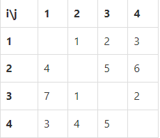

#  백준 14889 스타트와 링크

### 풀이 언어 : C++

문제 구분 : #백트래킹 #완전탐색
#### [LINK - 백준 14889 스타트와 링크](https://www.acmicpc.net/problem/14889)

### 문제
<hr>

오늘은 스타트링크에 다니는 사람들이 모여서 축구를 해보려고 한다. 축구는 평일 오후에 하고 의무 참석도 아니다. 축구를 하기 위해 모인 사람은 총 N명이고 신기하게도 N은 짝수이다. 이제 N/2명으로 이루어진 스타트 팀과 링크 팀으로 사람들을 나눠야 한다. BOJ를 운영하는 회사 답게 사람에게 번호를 1부터 N까지로 배정했고, 아래
와 같은 능력치를 조사했다. 능력치 $S_{ij}$는 i번 사람과 j번 사람이 같은 팀에 속했을 때, 팀에 더해지는 능력치이다. 팀의 능력치는 팀에 속한 모든 쌍의 능력치 $S_{ij}$의 합이다. $S_{ij}$는 $S_{ji}$와 다를 수도 있으며, i번 사람과 j번 사람이 같은 팀에 속했을 때, 팀에 더해지는 능력치는 $S_{ij}$와 $S_{ji}$이다.
N=4이고, $S_{ij}$가 아래 와 같은 경우를 살펴보자.



예를 들어, 1, 2번이 스타트 팀, 3, 4번이 링크 팀에 속한 경우에 두 팀의 능력치는 아래와 같다.

- 스타트 팀: $S_{12}$ + $S_{21}$ = 1 + 4 = 5
- 링크 팀: $S_{34}$ + $S_{43}$ = 2 + 5 = 7

1, 3번이 스타트 팀, 2, 4번이 링크 팀에 속하면, 두 팀의 능력치는 아래와 같다.

- 스타트 팀: $S_{13}$ + $S_{31}$ = 2 + 7 = 9
- 링크 팀: $S_{24}$ + $S_{42}$ = 6 + 4 = 10

축구를 재미있게 하기 위해서 스타트 팀의 능력치와 링크 팀의 능력치의 차이를 최소로 하려고 한다. 위의 예제와 같은 경우에는 1, 4번이 스타트 팀, 2, 3번 팀이 링크 팀에 속하면 스타트 팀의 능력치는 6, 링크 팀의 능력치는 6이 되어서 차이가 0이 되고 이 값이 최소이다.
### 입력
<hr>

첫째 줄에 N(4 ≤ N ≤ 20, N은 짝수)이 주어진다. 둘째 줄부터 N개의 줄에 S가 주어진다. 각 줄은 N개의 수로 이루어져 있고, i번 줄의 j번째 수는 $S_{ij}$ 이다. $S_{ii}$는 항상 0이고, 나머지 $S_{ij}$는 1보다 크거나 같고, 100보다 작거나 같은 정수이다.
### 출력
<hr>

첫째 줄에 스타트 팀과 링크 팀의 능력치의 차이의 최솟값을 출력한다.
### 풀이 이야기
<hr>

팀원들 중 절반 인원만을 조합으로 뽑는 것과 같은 문제이다. 여기서 중요한 점은 팀은 순서가 없기 때문에 순열로 뽑으면 안되고 조합을 활용하여 선출해야한다. 조합 뽑기 백트래킹을 활용해서 스타트팀을 모두 선출한 다음, 스타트 팀인 경우와 아닌 경우를 따로 계산하여 두 팀의 전력 차이를 계산했다.
사실 아래의 코드는 **가장 효율적인 코드**라고 보기에는 어렵다. 그 이유는 각 기저 사례마다 전체 스타트팀을 순회하고 있기 때문이다. 이 문제를 발견했다면, 백트래킹에 대해 이해도가 높다고 생각할 수 있다. 만약 잘 모르겠고, 항상 이런 식으로 구현하고 있었다면 다시 한번 생각해볼 필요가 있다. 백트래킹의 아이디어는 완전탐색에 기반을 두고있지만, 어떤 형식으로 구현하느냐에 따라서 시간초과가 날 수도 있지만, 아닐 수도 있다.

1. 중복된 값을 계산하고 있는가.
먼저 중복된 값을 계산하는 행위는 아래 코드에서 하고 있지는 않다. 예를 들면 순열과 같이 팀 조합을 순서를 고려하여 연산을 하였다면, 중복된 값을 계산하고 있다고 볼 수 있다. 백트래킹에서 시간초과에 가장 큰 요인을 더해주는 부분이다. 단순히 모든 경우를 반복하는 것 보다는 `유망한 값`들만을 고려하여 탐색하는 것이 백트래킹의 꽃이다.

1. 중복된 연산을 하고있는가.
여기서 문제있는 것은 중복된 연산을 하고 있는 것이다. 조합으로 잘 뽑고 있는데 어떤 중복된 연산을 말하는 것인가? 바로 마지막에 전력 차이를 계산하는 것이다. 아래 코드는 전력차이 계산을 위해서 무려 $N^2$의 연산을 진행하고 있다. 마지막에 전체 탐색을 통해서 이렇게 연산을 하는 것은 공간 복잡도 관점과 코드의 간결함에 있어서는 조금 나을 수 있지만, 시간 복잡도 측면에서는 많은 손해를 보고 있다. 예를 들어 스타트팀에 {1, 2, 3} 선수가 있는 것과 {1, 2, 4} 선수가 있는 것은 두개 모두 {1, 2} 선수들을 포함하고 있기 때문에 한번만 계산하면 더 빠르게 연산을 해낼 수 있다. 이를 위해서 각 팀들의 선수를 추가하는 당시에 배열이나, 변수를 활용하여 저장한다면 더 적은 연산으로 결과를 얻어낼 수 있을 것이다. 
대부분에 백트래킹 문제에서 해당하는 이야기이기 때문에 만약 아래 코드와 같이 기저 사례에서 항상 배열의 전체 탐색으로 답을 구하고 있다면, 한번쯤은 꼭 중복된 연산을 줄이는 연습을 해보자.
### 풀이 코드
<hr>

``` c++
#include <iostream>
#include <vector>

int N, ret = 2147483647;
std::vector<std::vector<int>> v; // 입력 S
std::vector<bool> chk; // 스타트팀 확인 배열

// 스타트팀과 링크팀 사이 전력 차이 계산 함수
int calc() {
	int star = 0;
	int link = 0;
	// 전체 순회
	for (int i = 0; i < N; i++) {
		for (int j = 0; j < N; j++) {
			if (chk[i] && chk[j]) // 스타트팀인 경우
				star += v[i][j];
			if (!chk[i] && !chk[j]) //링크팀인 경우
				link += v[i][j];
		}
	}
	return std::abs(star - link);
}

// 백트래킹
void solve(int depth, int m) {
	// 기저사례 : 2개의 팀으로 모두 나눈 경우
	if (depth == N / 2) {
		ret = std::min(ret, calc()); // 최소 업데이트
		return ;
	}
	// 스타트팀 인원 선택
	for (int i = m; i < N; i++) {
		if (chk[i]) // 이미 선택된 사람 제외
			continue ;
		chk[i] = true; // 선택 체킹
		solve(depth + 1, i); // 재귀함수
		chk[i] = false; // 체킹 원복
	}
}

int main(void) {
	// Input
	std::cin >> N;
	for (int i = 0; i < N; i++) {
		std::vector<int> vtmp;
		for (int j = 0 ; j < N; j++) {
			int tmp;
			std::cin >> tmp;
			vtmp.push_back(tmp);
		}
		chk.push_back(false);
		v.push_back(vtmp);
	}
	// Solve
	solve(0, 0);
	// Print
	std::cout << ret << std::endl;
}
```


