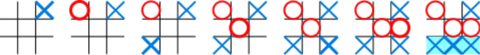

1~5 : 브론즈  
6~10 : 실버  
11~15 : 골드  
16~20 : 플레티넘  
21~25 : 다이아  
26~30 : 루비  

#  백준 16571 알파 틱택토


### 풀이 언어 : C++

문제 구분 : #백트래킹 #게임이론
#### [LINK - 백준 16571 알파 틱택토](https://www.acmicpc.net/problem/16571)

### 문제
<hr>

틱택토(Tic-tac-toe) 게임은 두 플레이어가 번갈아가며 O와 X를 3x3판에 써서 같은 글자를 가로, 세로, 혹은 대각선 상에 놓이도록 하는 게임이다.

먼저 3개의 연속 된 O 또는 X를 완성시킨 플레이어가 승리하게 된다. 이 게임은 무승부가 가능하다.



틱택토 초보 승현이와 기영이는 틱택토 게임을 플레이하고 있었다. 그런데 뒤에서 지켜보고 있던 틱택토 초고수 윤영이와 진욱이가 너무나 답답한 나머지 본인들이 대신 플레이를 해주겠다고 나섰다.

지금까지 진행 된 틱택토 게임 보드가 주어졌을 때, 이번에 착수하는 플레이어가 얻을 수 있는 최선의 게임 결과는 무엇일까? 단, 두 플레이어는 항상 모든 경우를 고려하여 최선의 수를 둔다고 가정한다.

### 입력
<hr>

현재까지 진행된 틱택토 게임 보드가 띄어쓰기로 구분되어 3줄에 걸쳐 주어진다. 0은 빈칸, 1은 X, 2는 O를 의미한다. 단, 항상 X가 선공이다. 그리고 이미 게임이 종료된 상태는 입력으로 주어지지 않는다.
### 출력
<hr>

첫째 줄에 주어진 게임 보드에서 **이번에 착수하는 플레이어**가 얻을 수 있는 최선의 게임 결과를 출력한다.

- 이기는 경우 "W", 무승부인 경우 "D", 지는 경우 "L"을 출력한다.
- 
### 풀이 이야기
<hr>

이 문제는 단순 백트래킹에서 게임 이론적인 요소가 포함된 문제이다. 처음에 **각자 최선의 수를 둘 때**라는 점을 인지하지 못하고 단순히 백트래킹으로 각자의 최선의 답을 구해 출력했더니, 해결되지 않았다. 이후에 각자의 최선을 두기 위해서 `Solve` 함수의 Return 값을 기반으로 해결을 하게 되었다.

```c++
// Solve
int solve(int player) {
    int winner;
    int optim = 2; // 0, 2 : 무승부 1 : 승리 -1 : 패배
    // 승리자
    winner = whoWin();
    // 이미 졌으면 -1
    if (winner != 0 && winner != player)
        return -1;
    // 빈칸 채우기
    for (int i = 0; i < 3; i++) {
        for (int j = 0; j < 3; j++) {
            if (!v[i][j]) {
                int tmp;
                v[i][j] = player;
                tmp = solve(player == 1 ? 2 : 1);
                // 각자 최적의 수 Update
                optim = std::min(optim, tmp);
                v[i][j] = 0;
            }
        }
    }
    // 최적의 수 변화가 없으면 Draw
    if (optim == 2 || optim == 0)
        return 0;
    // 이기는 수가 있으면 1
    return -optim;
}
```
먼저 기본적인 백트래킹 요소들은 현재 보드판에서 Winner가 존재하는지 확인하고 Return 하도록 한다. 이후 Winner가 존재하지 않으면 빈칸을 채우면서 내 수의 가장 유력한 수를 체크한다. 사실 백트래킹 요소보다 더 중요한 것은 어떠한 값을 Return 하느냐이다.

- 내가 지는 경우
```c++
    // 이미 졌으면 -1
    if (winner != 0 && winner != player)
        return -1;
```
먼저 내가 지는 경우에는 -1을 리턴하는 기저 사례를 가지고 있다. 내가 지는 경우를 -1로 한 이유는 다음 재귀호출의 Return 값 처리에서 자세히 설명할 것이다.

- 비기는 경우
```c++
    // 최적의 수 변화가 없으면 Draw
    if (optim == 2 || optim == 0)
        return 0;
```
비기는 경우에는 `optim` 값의 변화가 없거나 비겼다고 판단되어 Return 되는 경우가 있다. 비기는 경우가 0을 반환하는 이유도 이후에 재귀 호출을 처리하는 부분에서 자세히 설명하겠다.

- 내가 이기는 경우
```c++
    // 이기는 수가 있으면 1
    return -optim;
```
이기는 경우에는 1을 리턴하도록 한다.

```c++
    tmp = solve(player == 1 ? 2 : 1);
    // 각자 최적의 수 Update
    optim = std::min(optim, tmp);
```
이제 여기서 가장 핵심인 재귀호출을 어떻게 처리했고 Return값을 통해서 어떻게 최적의 숫자를 만들어 냈느냐이다. 일단 기본 논리는 **나에게 최적의 수는 상대가 지는 것이다**의 논리로 시작한다. 따라서 내 턴 이후에 상대 턴이 되었을 때 가장 좋은 것은 상대가 지는것 -> 비기는 것 -> 그다음이 이기는 것일 것이다. 따라서 현재에서 최적의 재귀호출의 Return값은 **상대가 지는 것**이 나와야 좋은 것이고 이기는 것이 나오면 안좋은 것이다. 따라서 수학적 연산을 통해 이를 반영하기 위해서는 `std::min`을 쓰려면 상대가 지는 것을 작은 숫자로, `std::max`를 쓰기 위해서는 상대가 지는 것을 큰 숫자로 설정하면 된다. 따라서 앞서 설명한 지는 수에 대한 `-1`리턴은 `std::min`을 사용하기 위해서 결정된 것이다.

단순히 백트래킹 뿐만 아니라 각자 현재에서 최적의 수를 계산하기 위해서 return 값을 조정하여 계산하는게 신기했고 인공지능의 역전파 개념과 살짝 비슷해 보였던것 같았다. 오목과 같은 AI 개발을 하는데에 있어 이런 최적의 수를 계산하는 인공지능을 만들 수 있을 것 같다.


### 풀이 코드
<hr>

``` c++
#include <iostream>
#include <vector>

int O, X, retPlayer; // 입력 변수
int ret; // 결과 변수
std::vector<std::vector<int>> v; // 틱택토 게임 판 배열

// 승리자를 판별하는 함수
int whoWin() {
    for (int i = 0; i < 3; i++) {
        if (v[i][0] != 0 && v[i][0] == v[i][1] && v[i][1] == v[i][2])
            return v[i][0];
    }
    for (int i = 0; i < 3; i++) {
        if (v[0][i] != 0 && v[0][i] == v[1][i] && v[1][i] == v[2][i])
            return v[0][i];
    }
    if (v[0][0] != 0 && v[0][0] == v[1][1] && v[1][1] == v[2][2])
        return v[0][0];
    if (v[2][0] != 0 && v[2][0] == v[1][1] && v[1][1] == v[0][2])
        return v[2][0];
    return 0;
}

// Solve
int solve(int player) {
    int winner;
    int optim = 2; // 0, 2 : 무승부 1 : 승리 -1 : 패배
    // 승리자
    winner = whoWin();
    // 이미 졌으면 -1
    if (winner != 0 && winner != player)
        return -1;
    // 빈칸 채우기
    for (int i = 0; i < 3; i++) {
        for (int j = 0; j < 3; j++) {
            if (!v[i][j]) {
                int tmp;
                v[i][j] = player;
                tmp = solve(player == 1 ? 2 : 1);
                // 각자 최적의 수 Update
                optim = std::min(optim, tmp);
                v[i][j] = 0;
            }
        }
    }
    // 최적의 수 변화가 없으면 Draw
    if (optim == 2 || optim == 0)
        return 0;
    // 이기는 수가 있으면 1
    return -optim;
}

int main(void) {
    // Input
    for (int i = 0; i < 3; i++) {
        std::vector<int> vtmp;
        for (int j = 0; j < 3; j++) {
            int tmp;
            std::cin >> tmp;
            if (tmp == 1)
                X += 1;
            else if (tmp == 2)
                O += 1;
            vtmp.push_back(tmp);
        }
        v.push_back(vtmp);
    }
    // Solve
    if (X == O)
        retPlayer = 1;
    else
        retPlayer = 2;
    ret = solve(retPlayer);
    // Print
    if (ret == 1)
        std::cout << "W" << std::endl;
    else if (ret == 0)
        std::cout << "D" << std::endl;
    else
        std::cout << "L" << std::endl;
}
```
