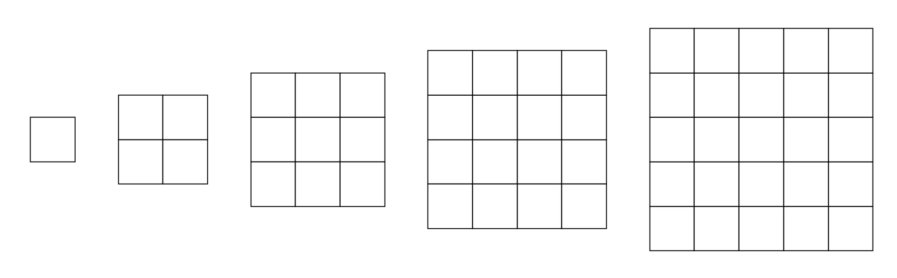

#  백준 17136 색종이 붙이기


### 풀이 언어 : C++

문제 구분 : #백트래킹 #완전탐색
#### [LINK - 백준 17136 색종이 붙이기](https://www.acmicpc.net/problem/17136)

### 문제
<hr>

<그림 1>과 같이 정사각형 모양을 한 다섯 종류의 색종이가 있다. 색종이의 크기는 1×1, 2×2, 3×3, 4×4, 5×5로 총 다섯 종류가 있으며, 각 종류의 색종이는 5개씩 가지고 있다.



색종이를 크기가 10×10인 종이 위에 붙이려고 한다. 종이는 1×1 크기의 칸으로 나누어져 있으며, 각각의 칸에는 0 또는 1이 적혀 있다. 1이 적힌 칸은 모두 색종이로 덮여져야 한다. 색종이를 붙일 때는 종이의 경계 밖으로 나가서는 안되고, 겹쳐도 안 된다. 또, 칸의 경계와 일치하게 붙여야 한다. 0이 적힌 칸에는 색종이가 있으면 안 된다.

종이가 주어졌을 때, 1이 적힌 모든 칸을 붙이는데 필요한 색종이의 최소 개수를 구해보자.

### 입력
<hr>

총 10개의 줄에 종이의 각 칸에 적힌 수가 주어진다.
### 출력
<hr>

모든 1을 덮는데 필요한 색종이의 최소 개수를 출력한다. 1을 모두 덮는 것이 불가능한 경우에는 -1을 출력한다.
### 풀이 이야기
<hr>

처음 이 문제를 접했을 때, 그리디로 풀이가 가능하다고 생각하여, 그리디로 해결하려고 시도했다. 5x5 -> 1x1 부터 순차적으로 가장 큰 색종이 부터 채워 넣다 보면, 해결이 가능할 것이라 생각했다. 하지만, 5x5를 먼저 넣는 경우 채울 수 없는 경우가 생겨 오답으로 처리되게 되었다. 따라서 백트래킹으로 풀이하기로 선회했다.

색종이 채우기와 같은 형식의 백트래킹 문제는 처음 만나본다면 구현하기에 쉽지 않다. 필자는 2차원 Grid의 백트래킹의 경우 1차원 변수 `cnt`를 N * M 개만큼 순회하면서 1차원 변수를 2차원 좌표 값으로 변경하는 방법을 택한다. 이 이유는 1차원 변수를 순회하면 자연스럽게 중복되게 세는 경우를 손쉽게 제외할 수 있다.

먼저 백트래킹의 2가지 기저 사례에 대해서 살펴보도록 하자.

```c++
    // 기저 사례 1: 모든 종이 공간에 색종이를 붙인 경우
    if (c == 0) {
        ret = std::min(ret, cpaper);
        return ;
    }
```
가장 기본적인 기저 사례이다. 모든 종이를 색종이로 덮었다면, 정답 업데이트와 함께 백트래킹을 그만 두어야한다.

```c++
    // 기저 사례 : 색종이를 다 사용했거나 Grid를 모두 순회했거나 이미 최적이 아닌 경우
    if (cpaper >= 25 || cpaper > ret || cnt == 100)
        return ;
```
두번째는 색종이를 다 사용하여 더 이상 진행이 안되는 경우. Grid를 모두 순회했지만, 정답을 찾지 못한 경우. 백트래킹 진행중이지만 이미 이전 최적 답보다 넘어가는 경우에는 백트래킹을 멈추어야 한다.

이후에 cnt를 N * M 까지 순회하면서 아래와 같은 절차를 따르면 문제를 해결할 수 있다.

**1. 색종이를 둘 수 있는 지점인지 확인**

먼저 색종이를 둘 수 있는 지점인지 먼저 확인해야한다. Grid에서 값이 0인 경우에는 이미 색종이로 덮여있거나 둘 수 없는 지점이라는 것이기 때문에 넘어간다.

**2. 둘 수 있다면 5x5 -> 1x1 까지 한번 씩 두고 넘어가기**

만약 Grid상에서 색종이를 둘 수 있는 지점이라면 여기에 색종이를 둘 수 있는지 확인해야 한다. 만약 1x1이라면 그냥 바로 둘 수 있겠지만, 5x5인 경우에는 해당 지점으로 부터 5x5 크기만큼 모두 둘 수 있어야 하기 때문에 해당하는 모든 지점을 재 탐색 해야한다.

```c++
bool block(int x, int y, int n) {
    // 색종이가 Grid를 벗어나거나, 이미 모두 사용한 종이라면 X
    if (x + n > 10 || y + n > 10 || paper[n] == 0)
        return false;
    // 색종이를 둘 수 있는지 완전 탐색
    for (int i = 0; i < n; i++) {
        for (int j = 0; j < n; j++) {
            if (map[y + i][x + j] == 0)
                return false;
        }
    }
    ...
```
해당 기능은 `block` 함수가 진행한다. 먼저 매개변수로 들어오는 x, y는 색종이를 둘 시작 지점을 뜻하고, n의 경우 nxn의 색종이 크기를 뜻한다. 따라서 먼저 색종이의 양 끝점이 Grid를 넘어가거나 색종이를 모두 사용한 시점이라면 둘 수 없는 것이기 때문에 Return 한다. 이후 NxN 만큼 순회하면서 모두 색종이를 둘 수 있는 지점 인지 확인한다. 둘 수 있는 지점이라면 해당 지점에 색종이를 두고 넘어간다.

위 행위를 반복적으로 진행하면 답에 도달할 수 있다.

### 🚨주의해야할 점
>**Q1. Solve함수의 c와 cpaper는 왜 있는 것인가요?**  
>**A1.** c는 현재 남은 빈칸을 의미하고, cpaper은 현재까지 사용한 색종이 수를 뜻한다. 이를 매개변수로 추가로 둔 이유는 시간복잡도를 줄이기 위해서이다. 단순히 기저 사례를 도달했을 때, Grid를 순회하면서 남은 빈칸을 확인하고 paper의 사용 현황을 계산할 수 있다. 하지만 이렇게 되면 한 기저 사례마다 최소 100번 이상의 연산이 활용되어야한다. 따라서 만약 기저 사례에 도달하는 경우가 100만번이라고 한다면 Grid 순회 연산 때문에 10억번 이상으로 시간 초과가 날 가능성이 생기게 된다. 따라서 색종이를 채울 때마다 빈칸의 개수를 업데이트 해주면서 불필요한 연산을 지우는 역할을 해준다.


### 풀이 코드
<hr>

``` c++
#include <iostream>
#include <vector>

std::vector<std::vector<int>> map; // 색종이 Grid
int paper[6] = {0, 5, 5, 5, 5, 5}; // 각 색종이 개수
int C, ret = 2147483647; // 입출력 변수

// 색종이 두거나 빼기
void setblock(int x, int y, int val, int n) {
    for (int i = 0; i < n; i++) {
        for (int j = 0; j < n; j++) {
            map[y + i][x + j] = val;
        }
    }
}

// 색종이를 둘 수 있으면 색종이 두기
bool block(int x, int y, int n) {
    // 색종이가 Grid를 벗어나거나, 이미 모두 사용한 종이라면 X
    if (x + n > 10 || y + n > 10 || paper[n] == 0)
        return false;
    // 색종이를 둘 수 있는지 완전 탐색
    for (int i = 0; i < n; i++) {
        for (int j = 0; j < n; j++) {
            if (map[y + i][x + j] == 0)
                return false;
        }
    }
    // 색종이 사용
    paper[n] -= 1;
    setblock(x, y, 0, n);
    return true;
}

// Solve
void solve(int cnt, int c, int cpaper) {
    // 기저 사례 1: 모든 종이 공간에 색종이를 붙인 경우
    if (c == 0) {
        ret = std::min(ret, cpaper);
        return ;
    }
    // 기저 사례 : 색종이를 다 사용했거나 Grid를 모두 순회했거나 이미 최적이 아닌 경우
    if (cpaper >= 25 || cpaper > ret || cnt == 100)
        return ;
    // cnt -> (x, y) 좌표로 변경
    int y = cnt / 10;
    int x = cnt % 10;
    // 이미 색종이로 채워져 있는 경우 PASS
    if (map[y][x] == 0)
        solve(cnt + 1, c, cpaper);
    else {
        // 5x5 색종이를 둘 수 있으면 채우기
        if (block(x, y, 5)) {
            solve(cnt + 5, c - 25, cpaper + 1);
            setblock(x, y, 1, 5);
            paper[5] += 1;
        }
        // 4x4 색종이를 둘 수 있으면 채우기
        if (block(x, y, 4)) {
            solve(cnt + 4, c - 16, cpaper + 1);
            setblock(x, y, 1, 4);
            paper[4] += 1;
        }
        // 3x3 색종이를 둘 수 있으면 채우기
        if (block(x, y, 3)) {
            solve(cnt + 3, c - 9, cpaper + 1);
            setblock(x, y, 1, 3);
            paper[3] += 1;
        }
        // 2x2 색종이를 둘 수 있으면 채우기
        if (block(x, y, 2)) {
            solve(cnt + 2, c - 4, cpaper + 1);
            setblock(x, y, 1, 2);
            paper[2] += 1;
        }
        // 1x2 색종이를 둘 수 있으면 채우기
        if (block(x, y, 1)) {
            solve(cnt + 1, c - 1, cpaper + 1);
            setblock(x, y, 1, 1);
            paper[1] += 1;
        }
    }
}

int main(void) {
    // Input
    for (int i = 0; i < 10; i++) {
        std::vector<int> vtmp;
        for (int j = 0; j < 10; j++) {
            int tmp;
            std::cin >> tmp;
            if (tmp)
                C += 1;
            vtmp.push_back(tmp);
        }
        map.push_back(vtmp);
    }
    // Solve
    solve(0, C, 0);
    // Print
    if (ret == 2147483647)
        std::cout << -1 << std::endl;
    else
        std::cout << ret << std::endl;
}
```
