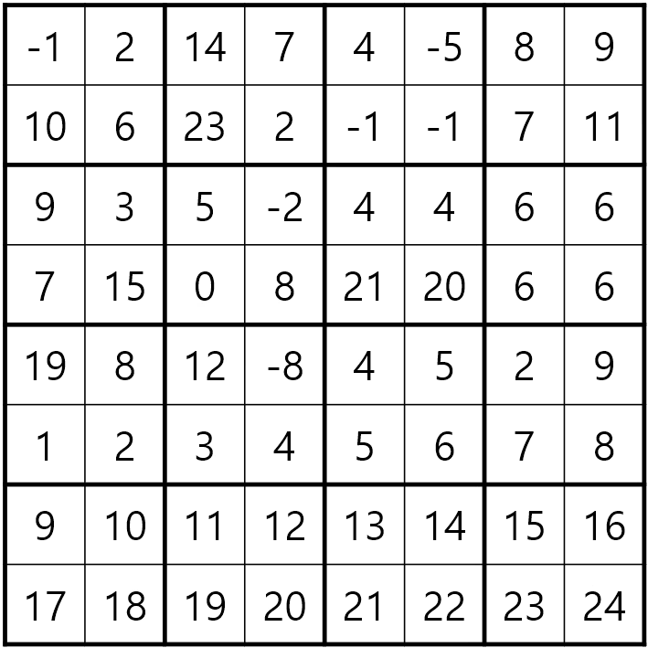

#  백준 17829 222-풀링


### 풀이 언어 : C++

문제 구분 : #분할정복
#### [LINK - 백준 17829 222-풀링](https://www.acmicpc.net/problem/17829)

### 문제
<hr>

조기 졸업을 꿈꾸는 종욱이는 요즘 핫한 딥러닝을 공부하던 중, 이미지 처리에 흔히 쓰이는 합성곱 신경망(Convolutional Neural Network, CNN)의 풀링 연산에 영감을 받아 자신만의 풀링을 만들고 이를 222-풀링이라 부르기로 했다.

다음은 8×8 행렬이 주어졌다고 가정했을 때 222-풀링을 1회 적용하는 과정을 설명한 것이다

1. 행렬을 2×2 정사각형으로 나눈다.

<center>  </center>

2. 각 정사각형에서 2번째로 큰 수만 남긴다. 여기서 2번째로 큰 수란, 정사각형의 네 원소를 크기순으로 a4 ≤ a3 ≤ a2 ≤ a1 라 했을 때, 원소 a2를 뜻한다.

<center>  </center>

3. 2번 과정에 의해 행렬의 크기가 줄어들게 된다.

종욱이는 N×N 행렬에 222-풀링을 반복해서 적용하여 크기를 1×1로 만들었을 때 어떤 값이 남아있을지 궁금해한다.

랩실 활동에 치여 삶이 사라진 종욱이를 애도하며 종욱이의 궁금증을 대신 해결해주자.
### 입력
<hr>

첫째 줄에 N(2 ≤ N ≤ 1024)이 주어진다. N은 항상 2의 거듭제곱 꼴이다. (N=2K, 1 ≤ K ≤ 10)

다음 N개의 줄마다 각 행의 원소 N개가 차례대로 주어진다. 행렬의 모든 성분은 -10,000 이상 10,000 이하의 정수이다. 
### 출력
<hr>

마지막에 남은 수를 출력한다.
### 풀이 이야기
<hr>

이 문제는 사각형을 4분할하여 2x2가 될 때까지 줄어들면서 재귀호출하고 2x2가 가장 최소 조건의 문제라고 생각하여 분할정복하면 되는 문제이다.

```c++
    std::priority_queue<int> square; // 우선순위 큐
    if (size == 2) {
        // 우선순위 큐에 2x2 요소 삽입
        square.push(v[x][y]);
        square.push(v[x][y + 1]);
        square.push(v[x + 1][y]);
        square.push(v[x + 1][y + 1]);
        square.pop(); // 가장 큰 수 삭제
        return square.top(); // 2번째 수 return
    }
```
먼저 기저사례인 2x2크기의 사각형을 때를 살펴보자. 222-폴링 규칙에 따라서 2x2 사각형일 때에는 2번째로 큰 수가 반환되어야 한다. 여러가지 방식이 존재할 수 있지만, 필자는 우선순위큐를 활용해서 4가지의 수를 삽입한 뒤에, 가장 큰 수를 삭제하는 방식으로 구현하였다.

```c++
    // 4가지 사각형으로 쪼개서 재귀호출
    int half = size / 2;
    square.push(solve(x, y, half));
    square.push(solve(x + half, y, half));
    square.push(solve(x, y + half, half));
    square.push(solve(x + half, y + half, half));
    square.pop();
    return square.top();
```
다음은 문제를 분할하는 부분이다. 해당 문제는 4가지의 사각형으로 분할하는 것이 핵심이다. 따라서 x, y좌표를 좌상단 좌표로 고정하여 size / 2를 기준으로 기준점과 size를 업데이트하면서 하나의 사각형을 4개의 작은 사각형으로 분할하도록 하였다. 또한, 각 사각형에서 진행된 222-폴링의 결과값들 중에서도 2번째로 큰수를 반환해주어야하기 때문에 기저사례와 동일하게 2번째로 큰 수를 반환하도록 하였다.

### 풀이 코드
<hr>

``` c++
#include <iostream>
#include <vector>
#include <queue>

int N; // 입력 변수
std::vector<std::vector<int>> v; // 입력 배열

int solve(int x, int y, int size) {
    std::priority_queue<int> square; // 우선순위 큐
    if (size == 2) {
        // 우선순위 큐에 2x2 요소 삽입
        square.push(v[x][y]);
        square.push(v[x][y + 1]);
        square.push(v[x + 1][y]);
        square.push(v[x + 1][y + 1]);
        square.pop(); // 가장 큰 수 삭제
        return square.top(); // 2번째 수 return
    }
    // 4가지 사각형으로 쪼개서 재귀호출
    int half = size / 2;
    square.push(solve(x, y, half));
    square.push(solve(x + half, y, half));
    square.push(solve(x, y + half, half));
    square.push(solve(x + half, y + half, half));
    square.pop();
    return square.top();
}

int main(void) {
    // Input
    std::cin >> N;
    for (int i = 0; i < N; i++) {
        std::vector<int> vtmp;
        for (int j = 0; j < N; j++) {
            int tmp;
            std::cin >> tmp;
            vtmp.push_back(tmp);
        }
        v.push_back(vtmp);
    }
    // Solve
    std::cout << solve(0, 0, N) << "\n";
}
```
