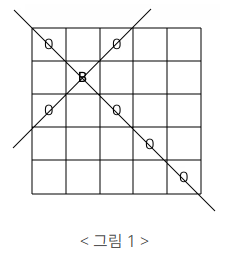
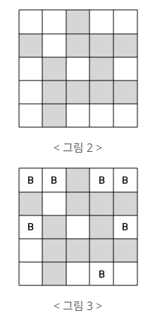

#  백준 1799 비숍


### 풀이 언어 : C++

문제 구분 : #백트래킹 #완전탐색
#### [LINK - 백준 1799 비숍](https://www.acmicpc.net/problem/1799)

### 문제
<hr>

서양 장기인 체스에는 대각선 방향으로 움직일 수 있는 비숍(bishop)이 있다. < 그림 1 >과 같은 정사각형 체스판 위에 B라고 표시된 곳에 비숍이 있을 때 비숍은 대각선 방향으로 움직여 O로 표시된 칸에 있는 다른 말을 잡을 수 있다.

<center> </center>

그런데 체스판 위에는 비숍이 놓일 수 없는 곳이 있다. < 그림 2 >에서 체스판에 색칠된 부분은 비숍이 놓일 수 없다고 하자. 이와 같은 체스판에 서로가 서로를 잡을 수 없도록 하면서 비숍을 놓는다면 < 그림 3 >과 같이 최대 7개의 비숍을 놓을 수 있다. 색칠된 부분에는 비숍이 놓일 수 없지만 지나갈 수는 있다.

<center> </center>

정사각형 체스판의 한 변에 놓인 칸의 개수를 체스판의 크기라고 한다. 체스판의 크기와 체스판 각 칸에 비숍을 놓을 수 있는지 없는지에 대한 정보가 주어질 때, 서로가 서로를 잡을 수 없는 위치에 놓을 수 있는 비숍의 최대 개수를 구하는 프로그램을 작성하시오.

### 입력
<hr>

첫째 줄에 체스판의 크기가 주어진다. 체스판의 크기는 10이하의 자연수이다. 둘째 줄부터 아래의 예와 같이 체스판의 각 칸에 비숍을 놓을 수 있는지 없는지에 대한 정보가 체스판 한 줄 단위로 한 줄씩 주어진다. 비숍을 놓을 수 있는 곳에는 1, 비숍을 놓을 수 없는 곳에는 0이 빈칸을 사이에 두고 주어진다.
### 출력
<hr>

첫째 줄에 주어진 체스판 위에 놓을 수 있는 비숍의 최대 개수를 출력한다.
### 풀이 이야기
<hr>

이 문제는 처음에 아이디어를 생각하기 쉽지 않았다. [N-Queen](./9663.md)과 매우 유사하다고 생각했지만, 대각선 방향은 생각보다 고려할게 많았다. 이에 체스판을 조금 돌려서 마름모 형태로 두고 N-Queen이라고 생각하고 풀면 어떨까라는 생각과 함께 풀이를 성공했다.

가장 중요한 점은 한 대각선에 1개만 둔다는 것을 고정하고 가야한다. 2개를 둘 수 있다고 생각하고 그때 그때 반복문으로 검사를 하면 속도가 급격히 떨어진다. 따라서 자료구조를 통해 대각선에 자연스럽게 1개만 둘 수 있도록 유도해야한다. 따라서 한 방향성의 대각선을 정해서 해당하는 대각선에 해당하는 (x, y) 좌표들을 미리 모아두고 한 대각선에 대해서 1개에만 자연스럽게 둘 수 있도록 구현했다.

<center>

| | | | | |
|-|-|-|-|-|
|1|2|3|4|5|
|2|3|4|5|6|
|3|4|5|6|7|
|4|5|6|7|8|
|5|6|7|8|9|
</center>

위 상황은 5X5 체스판에서 필자가 구현한 우상향 대각선을 각 index 별로 나눠 표현한 것이다. 각 숫자는 각 대각선의 순서를 나타낸다. 따라서 1번 (우상향) 대각선의 경우에는 1개의 좌표가 존재하고 4번 (우상향) 대각선의 경우에는 4개의 좌표가 존재하게 된다. 이를 저장하기 위해서 `std::vector<std::vector<std::pair<int, int>>>` 자료형을 사용했다. 가장 처음의 `vector`는 대각선들을 저장하는 곳이고, 두번째 `vector`는 해당 대각선에 좌표들을 저장하는 곳이다. 위 체스판을 해당 자료형으로 변환하면 아래와 같이 저장된다.


```
slash1 = {
    1번 대각선 = {(x, y)},
    2번 대각선 = {(x, y), (x, y)},
    3번 대각선 = {(x, y), (x, y), (x, y)},
    4번 대각선 = {(x, y), (x, y), (x, y), (x, y)},
    ...
    9번 대각선 = {(x, y)},
}

```

따라서 실제 대각선은 2N + 1개만큼 생성되고 위와 같은 자료형으로 Backtracking을 실시하면 된다. `depth`가 2N + 1이 될때를 기저사례로 삼아 `slash1[depth]` 중 한 좌표를 선택해서 Backtracking을 진행하면 이전에 설명한 자연스럽게 (우상향) 대각선에 대해서 한개의 비숍만을 선택할 수 있게 된다.

``` c++
for (int i = 0; i < slash1[depth].size(); i++) {
        // 좌상향 대각선에 비숍이 없다면
        if (chk(slash1[depth][i].first, slash1[depth][i].second)) {
            solveA(depth + 1, cnt + 1); // 재귀 호출
            map[slash1[depth][i].first][slash1[depth][i].second] = 1; // 원복
            avail = false;
        }
    }
```

이제는 **좌상향** 대각선에 대해서 처리를 해주어야 한다. 각 좌표를 선택하고 비숍을 두기 직전에는 항상 **좌상향** 대각선에 비숍이 있는지 체크해주어야 한다. Backtracking의 기본 **유망한 지점**을 찾는 것과 동일하다고 생각하면 된다. 이렇게 모든 (우상향) 대각선에 비숍 놓기를 시도하고 나서 기저 사례에 도달하게 된다면 최대 값을 업데이트 해주면 해결할 수 있다.

``` c++
bool chk(int y, int x) {
    // 좌상향 대각선 검사
    for (int i = 0; i < 2; i++) {
        int dx = x;
        int dy = y;
        while (dx >= 0 && dy >= 0 && dx < N && dy < N) {
            if (map[dy][dx] == -1)
                return false;
            dx += dir[i][0];
            dy += dir[i][1];
        }
    }
    // (x, y) 지점 비숍 두기
    map[y][x] = -1;
    return true;
}
```

### 더 빠르게 풀어보자!!

위 설명한 풀이로도 비숍 문제는 통과가 가능하다. 비숍 시간 제한이 10초나 되기 때문에 위 풀이로는 1800ms로 통과가 된다. 다만, 훨씬 더 빠르게 풀이가 가능한 방법이 존재한다. 그는 바로 체스 판의 특성을 활용하여 분할하여 풀이하는 방법이다.

통상 우리가 아는 체스판은 흰색과 검정색으로 나누어져 있다. 검정색에 있는 비숍은 흰색에 있는 비숍을 절대 잡을 수 없다. 따라서 이점을 활용하여 흰색 판에 대해서 계산하고, 검정색 판에서 대해서 계산하여 두 답의 합을 구하는 방식으로 구하면 훨씬 빠르게 구할 수 있다.

이전에는 각 재귀가 2N + 1 개 깊이 만큼 탐색했다면 2개로 나눠지면서 N번 깊이를 2번 해결 하면 된다. 

<center>

| | | | | |
|-|-|-|-|-|
|**1**|2|**3**|4|**5**|
|2|**3**|4|**5**|6|
|**3**|4|**5**|6|**7**|
|4|**5**|6|**7**|8|
|**5**|6|**7**|8|**9**|
</center>

아까 봤던 체스판에서 흰색과 검은색 체스판을 Bold체로 구분지어 보았다. 위 체스판을 흰색, 검정색을 나눠서 풀이를 할 것이기 때문에 자료구조는 아래와 같이 변경되어야 한다.


``` 
slash1 = {
    1번 대각선 = {(x, y)},
    3번 대각선 = {(x, y), (x, y), (x, y)},
    5번 대각선 = {(x, y), (x, y), (x, y), (x, y), (x, y)},
    7번 대각선 = {(x, y), (x, y), (x, y)},
    9번 대각선 = {(x, y)},
}

slash2 = {
    2번 대각선 = {(x, y), (x, y)},
    4번 대각선 = {(x, y), (x, y), (x, y), (x, y)},
    6번 대각선 = {(x, y), (x, y), (x, y), (x, y)},
    8번 대각선 = {(x, y), (x, y)},
}
```

위와 같이 2개의 대각선 집합으로 나눠서 풀이를 진행하면 된다. 이렇게 되면 재귀 횟수가 절반이나 줄기에 시간복잡도가 획기적으로 줄어들게 된다. 실제로 이 방식으로 풀이하면 1800ms 였던 시간이 0ms 까지 줄어든다.

### 🚨주의해야할 점
>**Q1. N의 홀수와 짝수가 중요할까?**  
>**A1.** N의 홀수, 짝수 여부는 이 풀이에서 생각보다 중요하다. 필자 구현에서는 흰색, 검정색 대각선을 나누는 과정에서 반복문 Index를 활용해서 구분하여 대각선 집합을 만들어낸다. (prepocess 함수) 이 때 짝수 인 경우와 홀수인 경우에 따라서 반복문의 시작 값을 변경해주어야 하는 경우가 생겼다. 단순히 생각해 보았을 때 짝수인 경우 왼쪽 최상단 대각선과 왼쪽 최하단 대각선의 색이 같지만, 홀수인 경우는 다르다.


### 풀이 코드
<hr>

``` c++
#include <iostream>
#include <vector>

std::vector<std::vector<int>> map; // 체스 판 배열
std::vector<std::vector<std::pair<int, int>>> slash1; // White 색상 우상향 대각선
std::vector<std::vector<std::pair<int, int>>> slash2; // Black 색상 우상향 대각선

// 비숍 이동 방향 (우상향 대각선은 1개 고정이기 때문에 좌상향으로 이동만 체크)
int dir[2][2] = {{1, 1}, {-1, -1}};
int N, ret1, ret2; // 입 출력 변수

// 우 상향 대각선 좌표 전처리
void preprocess() {
    // White 색상 우상향 대각선 전처리
    for (int i = 0; i < N; i += 2) { // y값 2칸씩 PASS
        int y = i;
        int x = 0;
        std::vector<std::pair<int, int>> vtmp;
        while (y >= 0 && x >=0 && y < N && x < N) {
            if (map[y][x]) { // 비숍을 둘 수 있으면
                // 좌표 제작
                std::pair<int, int> p;
                p.first = y;
                p.second = x;
                vtmp.push_back(p); // 좌표 배열 Push
            }
            // 우상향 이동
            y -= 1;
            x += 1;
        }
        // 우상향 좌표를 배열에 Push
        slash1.push_back(vtmp);
    }
    // N이 짝수인 경우와 홀수인 경우 색상 처리
    for (int i = N % 2 == 0 ? 1 : 2; i < N; i += 2) {
        int y = N - 1;
        int x = i;
        std::vector<std::pair<int, int>> vtmp;
        while (y >= 0 && x >=0 && y < N && x < N) {
            if (map[y][x]) { // 비숍을 둘 수 있으면
                // 좌표 제작
                std::pair<int, int> p;
                p.first = y;
                p.second = x;
                vtmp.push_back(p); // 좌표 배열 Push
            }
            // 우상향 이동
            y -= 1;
            x += 1;
        }
        // 우상향 좌표를 배열에 Push
        slash1.push_back(vtmp);
    }
    // Black 색상 우상향 대각선 전처리
    for (int i = 1; i < N; i += 2) {
        int y = i;
        int x = 0;
        std::vector<std::pair<int, int>> vtmp;
        while (y >= 0 && x >=0 && y < N && x < N) {
            if (map[y][x]) { // 비숍을 둘 수 있으면
                // 좌표 제작
                std::pair<int, int> p;
                p.first = y;
                p.second = x;
                vtmp.push_back(p);
            }
            // 우상향 이동
            y -= 1;
            x += 1;
        }
        slash2.push_back(vtmp);
    }
    for (int i = N % 2 == 0 ? 2 : 1; i < N; i += 2) {
        int y = N - 1;
        int x = i;
        std::vector<std::pair<int, int>> vtmp;
        while (y >= 0 && x >=0 && y < N && x < N) {
            if (map[y][x]) { // 비숍을 둘 수 있으면
                // 좌표 제작
                std::pair<int, int> p;
                p.first = y;
                p.second = x;
                vtmp.push_back(p); // 좌표 배열 Push
            }
            // 우상향 이동
            y -= 1;
            x += 1;
        }
        slash2.push_back(vtmp);
    }
}

// 좌상향 지점에 비숍이 존재하는지 체킹
bool chk(int y, int x) {
    // 좌상향 대각선 검사
    for (int i = 0; i < 2; i++) {
        int dx = x;
        int dy = y;
        while (dx >= 0 && dy >= 0 && dx < N && dy < N) {
            if (map[dy][dx] == -1)
                return false;
            dx += dir[i][0];
            dy += dir[i][1];
        }
    }
    // (x, y) 지점 비숍 두기
    map[y][x] = -1;
    return true;
}

// White 색상 비숍 놓기
void solveA(int depth, int cnt) {
    // 기저 사례 : 마지막 우상향 대각선에 도달 시
    if (depth == slash1.size()) {
        // 최대값 업데이트
        ret1 = std::max(ret1, cnt);
        return ;
    }
    // 한 우상향 대각선에 가능한 모든 좌표에 비숍을 1개 두어본다.
    bool avail = true;
    for (int i = 0; i < slash1[depth].size(); i++) {
        // 좌상향 대각선에 비숍이 없다면
        if (chk(slash1[depth][i].first, slash1[depth][i].second)) {
            solveA(depth + 1, cnt + 1); // 재귀 호출
            map[slash1[depth][i].first][slash1[depth][i].second] = 1; // 원복
            avail = false;
        }
    }
    // 우상향 모든 지점이 불가능 시 PASS 가능
    if (avail)
        solveA(depth + 1, cnt);
}

// Black 색상 비숍 놓기
void solveB(int depth, int cnt) {
    // 기저 사례 : 마지막 우상향 대각선에 도달 시
    if (depth == slash2.size()) {
        // 최대값 업데이트
        ret2 = std::max(ret2, cnt);
        return ;
    }
    // 한 우상향 대각선에 가능한 모든 좌표에 비숍을 1개 두어본다.
    bool avail = true;
    for (int i = 0; i < slash2[depth].size(); i++) {
        // 좌상향 대각선에 비숍이 없다면
        if (chk(slash2[depth][i].first, slash2[depth][i].second)) {
            solveB(depth + 1, cnt + 1); // 재귀 호출
            map[slash2[depth][i].first][slash2[depth][i].second] = 1; // 원복
            avail = false;
        }
    }
    // 우상향 모든 지점이 불가능 시 PASS 가능
    if (avail)
        solveB(depth + 1, cnt);
}

int main(void) {
    // Input
    std::cin >> N;
    for (int i = 0; i < N; i++) {
        std::vector<int> vtmp;
        for (int j = 0; j < N; j++) {
            int tmp;
            std::cin >> tmp;
            vtmp.push_back(tmp);
        }
        map.push_back(vtmp);
    }
    // Solve
    preprocess();
    solveA(0, 0);
    solveB(0, 0);
    // Print
    std::cout << ret1 + ret2 << std::endl;
}
```
