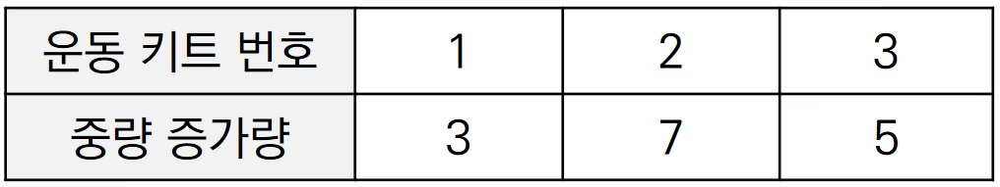
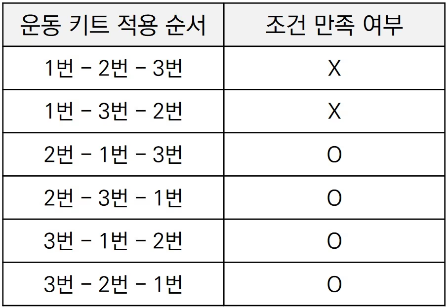

#  백준 18429 근손실

### 풀이 언어 : C++

문제 구분 : #백트래킹 #완전탐색
#### [LINK - 백준 18429 근손실](https://www.acmicpc.net/problem/18429)

### 문제
<hr>

웨이트 트레이닝을 좋아하는 어떤 대학원생은, 현재 3대 운동 중량 500의 괴력을 소유하고 있다. 다만, 하루가 지날 때마다 중량이 K만큼 감소한다. 예를 들어 K=4일 때, 3일이 지나면 중량이 488로 감소하게 된다. 따라서 운동을 하지 않고, 가만히 있다면 매일매일 중량이 감소할 뿐이다.

다행히도 이 대학원생은 N개의 서로 다른 운동 키트를 가지고 있다. 이 대학원생은 하루에 1개씩의 키트를 사용하며, 매일 어떤 키트를 사용할 지는 마음대로 결정할 수 있다. 운동 키트들은 각각의 중량 증가량을 가지고 있으며, 사용할 때마다 즉시 중량이 증가하게 된다. 이 때 몇몇 운동 키트들의 중량 증가량이 같을 수 있으나, 서로 다른 운동 키트로 간주한다. 각각의 운동 키트는 N일 동안 한 번씩만 사용할 수 있다.

대학원생은 운동 기간동안 항상 중량이 500 이상으로 유지가 되도록 N일간의 운동 플랜을 세우고자 한다. 1일차부터 N일차까지의 모든 기간동안, 어떤 시점에서라도 중량이 500보다 작아지지 않도록 해야 한다.

예를 들어 N=3, K=4일 때, 각 운동 키트의 중량 증가량이 다음과 같다고 가정하자.

<center>  </center>

이 때 1번, 3번, 2번 순서대로 운동 키트를 적용한다고 해보자. 이 경우 운동 1일차에 대학원생은 중량이 3만큼 증가하지만 그와 동시에 하루에 중량이 4만큼 감소하기 때문에, 1일이 지난 이후에 중량은 499가 된다. 따라서 조건을 만족하지 못한다.

반면에 3번, 1번, 2번 순서대로 운동 키트를 적용한다고 해보자. 그러면 1일차부터 운동을 모두 마친 날까지의 모든 시점에 대하여 항상 중량이 500이상이 된다.

N개의 운동 키트에 대한 정보가 주어졌을 때, N일간 하루에 1개씩의 운동 키트를 사용하는 모든 경우 중에서, 운동 기간동안 항상 중량이 500 이상이 되도록 하는 경우의 수를 출력하는 프로그램을 작성하시오.

위 예시에서는 모든 경우 중에서 총 4가지 경우가 조건을 만족한다.

<center>  </center>


### 입력
<hr>

첫째 줄에 자연수 N과 K가 공백을 기준으로 구분되어 주어진다. (1 ≤ N ≤ 8, 1 ≤ K ≤ 50) 둘째 줄에 각 운동 키트의 중량 증가량 A가 공백을 기준으로 구분되어 주어진다. (1 ≤ A ≤ 50)
### 출력
<hr>

N일 동안 N개의 운동 키트를 사용하는 모든 경우 중에서, 운동 기간동안 항상 중량이 500 이상이 되도록 하는 경우의 수를 출력한다.
### 풀이 이야기
<hr>

기본적인 백트래킹의 문제이다. 기저사례를 정한 뒤에 유망한 지점을 기준으로 백트래킹을 시도하면 쉽게 해결할 수 있다.

```c++
    // 기저 사례 : N일간 운동을 성공한 경우
    if (depth == N) {
        ret += 1;
        return ;
    }
```
이 문제에서의 기저사례는 N일간 운동을 성공한 경우와 같다. N일 동안 운동을 성공한 경우에 정답 조건에 부합하기 때문에 ret을 1을 추가한다.

```c++
 for (int i = 0; i < N; i++) {
        // 이미 사용한 운동이거나 500 이하로 내려가면 PASS
        if (chk[i] || v[i] + weight - K < 500)
            continue ;
        chk[i] = true; // 현재 운동기구 사용
        solve(depth + 1, weight - K + v[i]); // 재귀
        chk[i] = false; // 원복
    }
```
두 번재로는 유망한 지점을 찾는 것이다. 이 문제의 조건은 항상 500KG 밑으로 내려가지 않는 선에서 운동 종류의 순열을 찾아내는 것이다. 따라서 매일 운동을 선택할 때 500KG으로 내려가지 않는 운동만을 선택하여 탐색을 진행한다. 이렇게 하면 자연스럽게 500KG보다 작은 경우는 걸러지면서 모든 경우를 탐색할 수 있게 된다.

### 풀이 코드
<hr>

``` c++
#include <iostream>
#include <vector>

std::vector<int> v; // 입력 배열
std::vector<bool> chk; // 사용 확인 chk 배열
int N, K, ret; // 입출력 변수

// Solve
void solve(int depth, int weight) {
    // 기저 사례 : N일간 운동을 성공한 경우
    if (depth == N) {
        ret += 1;
        return ;
    }
    // N개의 운동기구를 선택
    for (int i = 0; i < N; i++) {
        // 이미 사용한 운동이거나 500 이하로 내려가면 PASS
        if (chk[i] || v[i] + weight - K < 500)
            continue ;
        chk[i] = true; // 현재 운동기구 사용
        solve(depth + 1, weight - K + v[i]); // 재귀
        chk[i] = false; // 원복
    }
}

int main(void) {
    // Input
    std::cin >> N >> K;
    for (int i = 0; i < N; i++) {
        int tmp;
        std::cin >> tmp;
        v.push_back(tmp);
        chk.push_back(false);
    }
    // Solve
    solve(0, 500);
    // Print
    std::cout << ret << std::endl;
}
```
