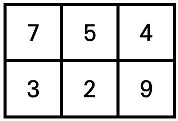
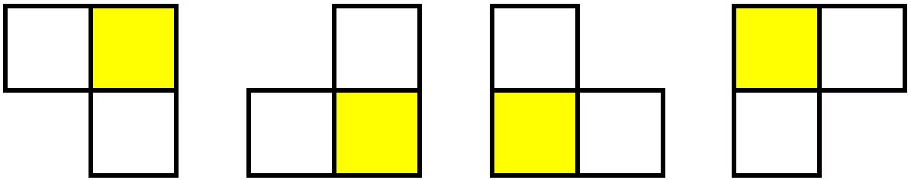
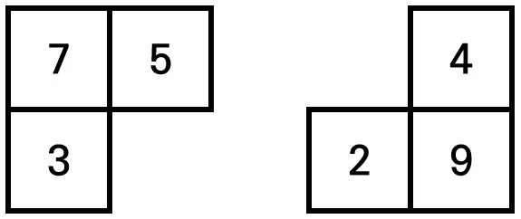
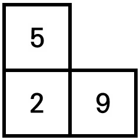

#  백준 18430 무기 공학

### 풀이 언어 : C++

문제 구분 : #백트래킹 #완전탐색 
#### [LINK - 백준 18430 무기 공학](https://www.acmicpc.net/problem/18430)

### 문제
<hr>

공학자 길동이는 외부의 침략으로부터 마을을 지킬 수 있는 부메랑 무기를 개발하는 공학자다. 길동이는 부메랑 제작을 위한 고급 나무 재료를 구했다. 이 나무 재료는 NxM크기의 직사각형 형태이며 나무 재료의 부위마다 그 강도가 조금씩 다르다. 예를 들어 나무 재료의 크기가 2x3일 때는 다음과 같이 총 6칸으로 구성된다.

<center></center>

길동이는 이처럼 넓은 사각형 형태의 나무 재료를 잘라서 여러 개의 부메랑을 만들고자 한다. 그리고 부메랑은 항상 3칸을 차지하는 ‘ㄱ’모양으로 만들어야 한다. 따라서 부메랑의 가능한 모양은 다음과 같이 총 4가지다.

<center></center>

이때 부메랑의 중심이 되는 칸은 강도의 영향을 2배로 받는다. 위 그림에서 노란색으로 칠한 부분이 ‘중심이 되는 칸’이다. 예를 들어 앞선 예시에서는 다음과 같이 2개의 부메랑을 만들 수 있으며, 이때 만들어지는 부메랑들의 강도의 합은 46으로 이보다 강도의 합이 높아지는 경우는 없다.

<center></center>

또한 나무 재료의 특정 위치는 아예 사용하지 않아도 괜찮다. 예를 들어 앞선 예시에서 다음과 같이 1개의 부메랑만을 만들어도 괜찮다. 다만, 이렇게 만들게 되면 부메랑들의 강도의 합이 18이 되기 때문에 비효율적이다.


<center></center>

나무 재료의 형태와 각 칸의 강도가 주어졌을 때, 길동이가 만들 수 있는 부메랑들의 강도 합의 최댓값을 출력하는 프로그램을 작성하시오.
### 입력
<hr>

첫째 줄에는 길동이가 가지고 있는 나무 재료의 세로, 가로 크기를 의미하는 두 자연수 N, M이 주어진다. $(1 ≤ N, M ≤ 5)$ 다음 N개의 줄에 걸쳐서, 매 줄마다 나무 재료의 각 위치의 강도를 나타내는 M개의 자연수 K가 공백을 기준으로 구분되어 주어진다. $(1 ≤ K ≤ 100)$
### 출력
<hr>

첫째 줄에 길동이가 만들 수 있는 부메랑들의 강도 합의 최댓값을 출력한다. 단, 나무 재료의 크기가 작아서 부메랑을 하나도 만들 수 없는 경우는 0을 출력한다.
### 풀이 이야기
<hr>

각 지점에서 4가지의 블럭을 모두 놓아보면서 가장 높은 점수일 때, 점수를 업데이트하면 풀 수 있는 문제이다. 다만, 각 블록을 두고 빼는 과정이 다량의 코드를 만들어내기 때문에 코드가 다른 백트래킹 문제에 대비하여 약간 복잡하다. 필자는 먼저 2X2 사각형을 형상화하여 왼쪽 상단에 있는 지점을 기준으로 4가지 부메랑을 놓아보는 것으로 기준을 삼았다. 이에 따라 각 블럭을 `blocks[4][3][2]`라는 배열에 저장하는데 `block[i]`는 i번째의 블록 종류를 말하는 것이고, `block[i][j]`는 i번째 블록 종류에서의 어떤 블록인지를 뜻하며, `blocks[i][j][k]`는 x, y좌표에 대한 변위 값(기준은 앞서 설명한 2X2 사각형에서 왼쪽 상단 지점이다.)을 저장한다. 또한 `blocks[i][j]`의 경우 2번째(index = 1)가 2배 강도가 되는 지점으로 통일했다.

이 블록 배열을 통해서 각 지점에서 모든 블록을 놓는 것을 시도한다. 만약 블록을 놓고 난 뒤에는 해당 지점에 다시 블록을 사용할 수 없기 때문에 `visited` 배열로 지속적으로 체킹한다. 이렇게 재귀함수를 통해서 모든 경우의 강도를 확인 후 가장 큰 강도를 얻어낼 수 있다.

**🚨주의해야할 점**
>**Q1. 해당 지점에서 꼭 블록(나무)를 사용시도해야할까?**  
>**A1.** 정답은 아니다. (0, 0)지점에서 나무를 사용하지 않는 것이 더 높은 강도의 부메랑을 만들지도 모른다. 따라서 단순히 블록을 놓을 수 있다고해서 블록을 놓는 경우만 고려하면 안되며, 블록을 놓지 않고 그냥 넘어가는 경우도 고려해야한다.
### 풀이 코드
<hr>

``` c++
#include <iostream>
#include <vector>

std::vector<std::vector<int>> grid; // Input Grid
std::vector<std::vector<bool>> visited; // 사용 Check

// 선택 가능 블록 4개
int blocks[4][3][2] = {
	{{0,0}, {1,0}, {1,1}},
	{{1,0}, {1,1}, {0,1}},
	{{0,0}, {0,1}, {1,1}},
	{{1,0}, {0,0}, {0,1}}
};
int N, M; // Input 변수
int ret; // Print 변수

// Backtracking
void solve(int cnt, int point) {
	ret = std::max(ret, point); // Point Update
	// 기저 사례 : 마지막 칸까지 도달하면 Ret
	if (cnt == N*M)
		return ;
	// cnt -> (x, y) 좌표 변환
	int x = cnt % M;
	int y = cnt / M;
	// 블록을 놓을 수 없는 지점이라면 PASS
	if (x + 1 >= M || y + 1 >= N) {
		solve(cnt + 1, point);
		return ;
	}
	// 4가지 블록 시도
	for (int i = 0; i < 4; i++) {
		bool chk = true;
		// 블록을 놓을 수 있는지 확인 (블록 겹치지 방지)
		for (int j = 0; j < 3; j++) {
			int dx = blocks[i][j][0];
			int dy = blocks[i][j][1];
			if (visited[y + dy][x + dx]) {
				chk = false;
				break ;
			}
		}
		// 블록을 놓을 수 있을 때
		if (chk) {
			// 블록 Check 표시
			for (int j = 0; j < 3; j++) {
				int dx = blocks[i][j][0];
				int dy = blocks[i][j][1];
				visited[y + dy][x + dx] = true;
			}
			// 무기 강도 계산
			point += grid[y + blocks[i][0][1]][x + blocks[i][0][0]];
			point += grid[y + blocks[i][1][1]][x + blocks[i][1][0]] * 2;
			point += grid[y + blocks[i][2][1]][x + blocks[i][2][0]];
			solve(cnt + 1, point); // 재귀호출
			// 무기 강도 복귀
			point -= grid[y + blocks[i][0][1]][x + blocks[i][0][0]];
			point -= grid[y + blocks[i][1][1]][x + blocks[i][1][0]] * 2;
			point -= grid[y + blocks[i][2][1]][x + blocks[i][2][0]];
			// 블록 Check 복귀
			for (int j = 0; j < 3; j++) {
				int dx = blocks[i][j][0];
				int dy = blocks[i][j][1];
				visited[y + dy][x + dx] = false;
			}
		}
	}
	solve(cnt + 1, point); // 현재 칸 PASS
} 

int main(void) {
	// Input
	std::cin >> N >> M;
	for (int i = 0; i < N; i++) {
		std::vector<int> tmp;
		std::vector<bool> tmp2;
		for (int j = 0; j < M; j++) {
			int tt;
			std::cin >> tt;
			tmp.push_back(tt);
			tmp2.push_back(false);
		}
		visited.push_back(tmp2);
		grid.push_back(tmp);
	}
	// Solve
	solve(0, 0);
	// Print
	std::cout << ret << std::endl;
}
```


