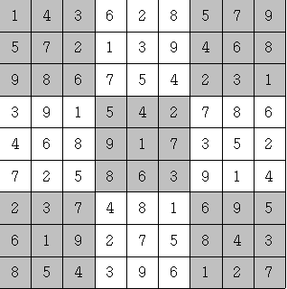

#  백준 2239 스도쿠


### 풀이 언어 : C++

문제 구분 : #백트래킹 #완전탐색
#### [LINK - 백준 2239 스도쿠](https://www.acmicpc.net/problem/2239)

### 문제
<hr>

스도쿠는 매우 간단한 숫자 퍼즐이다. 9×9 크기의 보드가 있을 때, 각 행과 각 열, 그리고 9개의 3×3 크기의 보드에 1부터 9까지의 숫자가 중복 없이 나타나도록 보드를 채우면 된다. 예를 들어 다음을 보자.

<center>  </center>

위 그림은 참 잘도 스도쿠 퍼즐을 푼 경우이다. 각 행에 1부터 9까지의 숫자가 중복 없이 나오고, 각 열에 1부터 9까지의 숫자가 중복 없이 나오고, 각 3×3짜리 사각형(9개이며, 위에서 색깔로 표시되었다)에 1부터 9까지의 숫자가 중복 없이 나오기 때문이다.

하다 만 스도쿠 퍼즐이 주어졌을 때, 마저 끝내는 프로그램을 작성하시오.


### 입력
<hr>

9개의 줄에 9개의 숫자로 보드가 입력된다. 아직 숫자가 채워지지 않은 칸에는 0이 주어진다.
### 출력
<hr>

9개의 줄에 9개의 숫자로 답을 출력한다. 답이 여러 개 있다면 그 중 사전식으로 앞서는 것을 출력한다. 즉, 81자리의 수가 제일 작은 경우를 출력한다.

### 풀이 이야기
<hr>

이 문제는 [백준 2580 스도쿠](./2580.md) 문제와 동일한 문제이다. 다만 입력 형식이 조금 다를 뿐이다. 따라서 해당 문제의 코드를 입력을 수정하여 풀이하였다. 자세한 설명은 2580 스도쿠 문제를 확인해보자.

### 풀이 코드
<hr>

``` c++
#include <iostream>
#include <vector>
#include <string>

std::vector<std::vector<int>> map;
std::vector<std::string> input;

// 현재 위치에 n을 넣을 수 있는지 검사
bool chk(int n, int x, int y) {
	// 가로, 세로 겹치는 수 검사
	for (int i = 0; i < 9; i++) {
		if (map[y][i] == n)
			return false;
		if (map[i][x] == n)
			return false;
	}
	// 작은 3x3 구역에 n이 있는지 검사
	for (int i = (y / 3) * 3; i < (y / 3) * 3 + 3; i++) {
		for (int j = (x / 3) * 3; j < (x / 3) * 3 + 3; j++) {
			if (map[i][j] == n)
				return false;
		}
	}
	return true;
}

// Backtracking
int solve() {
	// 스도쿠 판에서 빈칸 찾기
	int x = -1;
	int y = -1;
	for (int i = 0; i < 81; i++) {
		if (map[i / 9][i % 9] == 0) {
			x = i % 9;
			y = i / 9;
			break ;
		}
	}
	// 빈킨이 없다면 성공
	if (x == -1 || y == -1)
		return 1;
	// 빈칸에 대해서 1 ~ 9 까지 시도
	for (int i = 1 ; i <= 9; i++) {
		// 겹치지 않다면 시도
		if (chk(i, x, y)) {
			map[y][x] = i;
			if (solve()) // 완성되었다면 return
				return 1;
			map[y][x] = 0;
		}
	}
	return 0;
}

int main(void) {
    // 2239번 문제 Input
    for (int i = 0; i < 9; i++) {
        std::string tmp;
        std::cin >> tmp;
        input.push_back(tmp);
    }
    // 2580 문제 형식으로 Input 변환
    for (int i = 0; i < 9; i++) {
        std::vector<int> vt;
        for (int j = 0; j < 9; j++) {
            vt.push_back(input[i][j] - '0');
        }
        map.push_back(vt);
    }
    // Solve
    solve();
    // Print
    for (int i = 0; i < 9; i++) {
        for (int j = 0 ; j < 9; j++) {
            std::cout << map[i][j];
        }
        std::cout << "\n";
    }
}
```
