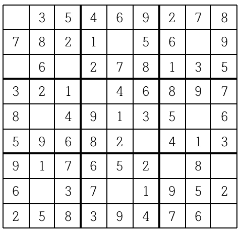
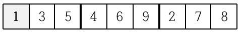
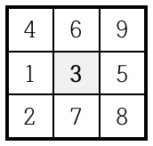
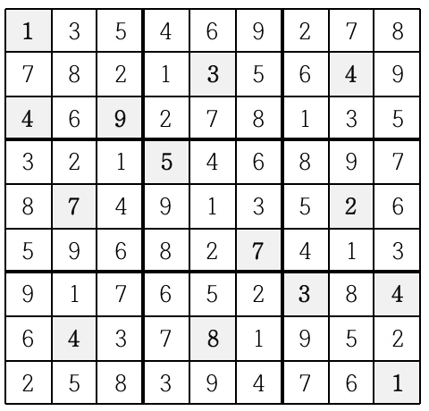

#  백준 2580 스도쿠

### 풀이 언어 : C++

문제 구분 : #백트래킹 #완전탐색 
#### [LINK - 백준 2580 스도쿠](https://www.acmicpc.net/problem/2580)

### 문제
<hr>

스도쿠는 18세기 스위스 수학자가 만든 '라틴 사각형'이랑 퍼즐에서 유래한 것으로 현재 많은 인기를 누리고 있다. 이 게임은 아래 그림과 같이 가로, 세로 각각 9개 씩 총 81개의 작은 칸으로 이루어진 정사각형 판 위에서 이뤄지는데, 게임 시작 전 일부 칸에는 1부터 9까지의 숫자 중 하나가 쓰여 있다.

<center></center>

나머지 빈 칸을 채우는 방식은 다음과 같다.
1. 각각의 가로줄과 세로줄에는 1부터 9까지의 숫자가 한 번씩만 나타나야 한다.
2. 굵은 선으로 구분되어 있는 3x3 정사각형 안에도 1부터 9까지의 숫자가 한 번씩만 나타나야 한다.
위의 예의 경우, 첫째 줄에는 1을 제외한 나머지 2부터 9까지의 숫자들이 이미 나타나 있으므로 첫째 줄 빈칸에는 1이 들어가야 한다.

<center></center>

또한 위쪽 가운데 위치한 3x3 정사각형의 경우에는 3을 제외한 나머지 숫자들이 이미 쓰여있으므로 가운데 빈 칸에는 3이 들어가야 한다.

<center></center>

이와 같이 빈 칸을 차례로 채워 가면 다음과 같은 최종 결과를 얻을 수 있다.

<center></center>

게임 시작 전 스도쿠 판에 쓰여 있는 숫자들의 정보가 주어질 때 모든 빈 칸이 채워진 최종 모습을 출력하는 프로그램을 작성하시오.

### 입력
<hr>

아홉 줄에 걸쳐 한 줄에 9개씩 게임 시작 전 스도쿠판 각 줄에 쓰여 있는 숫자가 한 칸씩 띄워서 차례로 주어진다.
스도쿠 판의 빈 칸의 경우에는 0이 주어진다. 스도쿠 판을 규칙대로 채울 수 없는 경우의 입력은 주어지지 않는다.
### 출력
<hr>

모든 빈 칸이 채워진 스도쿠 판의 최종 모습을 아홉 줄에 걸쳐 한 줄에 9개씩 한 칸씩 띄워서 출력한다. 스도쿠 판을 채우는 방법이 여럿인 경우는 그 중 하나만을 출력한다.
### 풀이 이야기
<hr>

스도쿠 문제는 단순한 백트래킹 문제 중 하나이다. 다만 재귀 호출을 시작할때 모든 지점을 검사하는 것이 아니라, 아직 채워지지 않은 x, y를 검사하여 해당 지점을 채우는 방식으로 구현해야 불필요한 검사를 줄일 수 있다. 만약 채워지지 않은 지점으라면 해당 지점에서 1~9까지의 숫자를 모두 시도해보는데, 이때 가로와 세로, 그리고 해당 범위에서 겹치는 숫자가 있는지 확인한다. 가로와 세로는 단순히 인덱스로 검사하면 되고, 범위의 경우에는 x와 y를 3으로 나눈 지점을 기준으로 3X3 사각형을 검사하면 된다.

보통은 2차원을 탐색할 때 코드의 가시성을 위해서 2차 반복문을 쓰는 것이 보통이지만, 코드의 간결함을 위해서 아직 채워지지 않은 x, y를 검사할 때 1차 반복문을 통해서 구현했다. 크게 어려운 부분은 아니지만, 2차원 반복문을 break하기 위한 flag의 간소화를 위해서 해당 방식을 채택했다.

### 🚨주의해야할 점
>**Q1. 2차원 Map에서 X, Y가 의미하는 것?**  
>**A1.** 우리가 일반적으로 생각하는 X(가로축), Y(세로축)으로 생각하기에 변수이름도 가로는 x, 세로는 y로 짓기 쉽다. 하지만, Index 관점에서 바라보았을 때, $M[i][j]$ 에서 i는 세로축, j는 가로축을 가지고 있다. 통상 수학에서는 **(x, y)** 순으로 좌표를 표기하지만, Index 관점에서는 **(y, x)** 임을 잊지 말아야한다. 어려운 개념은 아니지만, 자주 실수가 나오는 부분이니 꼭 확인해보자!
### 풀이 코드
<hr>

``` c++
#include <iostream>
#include <vector>

std::vector<std::vector<int>> map; // 스도쿠 배열

// 현재 위치에 n을 넣을 수 있는지 검사
bool chk(int n, int x, int y) {
	// 가로, 세로 겹치는 수 검사
	for (int i = 0; i < 9; i++) {
		if (map[y][i] == n)
			return false;
		if (map[i][x] == n)
			return false;
	}
	// 작은 3x3 구역에 n이 있는지 검사
	for (int i = (y / 3) * 3; i < (y / 3) * 3 + 3; i++) {
		for (int j = (x / 3) * 3; j < (x / 3) * 3 + 3; j++) {
			if (map[i][j] == n)
				return false;
		}
	}
	return true;
}

// Backtracking
int solve() {
	// 스도쿠 판에서 빈칸 찾기
	int x = -1;
	int y = -1;
	for (int i = 0; i < 81; i++) {
		if (map[i / 9][i % 9] == 0) {
			x = i % 9;
			y = i / 9;
			break ;
		}
	}
	// 빈킨이 없다면 성공
	if (x == -1 || y == -1)
		return 1;
	// 빈칸에 대해서 1 ~ 9 까지 시도
	for (int i = 1 ; i <= 9; i++) {
		// 겹치지 않다면 시도
		if (chk(i, x, y)) {
			map[y][x] = i;
			if (solve()) // 완성되었다면 return
				return 1;
			map[y][x] = 0;
		}
	}
	return 0;
}

int main(void) {
	// Input
	for (int i = 0; i < 9; i++) {
		std::vector<int> vt;
		for (int j = 0; j < 9; j++) {
			int tmp;
			std::cin >> tmp;
			vt.push_back(tmp);
		}
		map.push_back(vt);
	}
	// Solve
	solve();
	// Print
	for (int i = 0; i < 9; i++) {
		for (int j = 0 ; j < 9; j++) {
			std::cout << map[i][j] << " ";
		}
		std::cout << "\n";
	}
}
```


