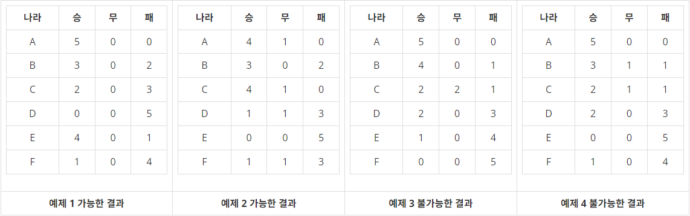

#  백준 6987 월드컵

### 풀이 언어 : C++

문제 구분 : #백트래킹 #완전탐색
#### [LINK - 백준 6987 월드컵](https://www.acmicpc.net/problem/6987)

### 문제
<hr>

월드컵 조별 최종 예선에서는 6개국으로 구성된 각 조별로 동일한 조에 소속된 국가들과 한 번씩, 각 국가별로 총 5번의 경기를 치른다. 조별리그가 끝난 후, 기자가 보내온 각 나라의 승, 무승부, 패의 수가 가능한 결과인지를 판별하려고 한다. 다음은 가능한 결과와 가능하지 않은 결과의 예이다.

<center>  </center>

### 입력
<hr>

네 가지의 결과가 주어질 때 각각의 결과에 대하여 가능하면 1, 불가능하면 0을 출력하는 프로그램을 작성하시오.

### 출력
<hr>

입력에서 주어진 네 가지 결과에 대하여 가능한 결과는 1, 불가능한 결과는 0을 빈칸을 하나 사이에 두고 출력한다.

### 풀이 이야기
<hr>

이 문제는 경기들의 모든 경우를 시뮬레이션 해보면서 정답과 다른 즉시 Return하고 옳은 방향으로 가고 있을 때는 지속하여 진행하는 방식으로 구현했다. 처음에 접근했을 때 단순히 승, 무, 패의 숫자만으로 구별이 가능하다고 생각했지만, 각 팀별 승패에 따라서 결과가 달라질 수 있는 만큼 숫자의 연산만으로는 풀이가 불가능하다고 판단하여 완전 탐색쪽으로 방향을 틀었다. 완전 탐색을 진행할 때는 대략 얼만큼의 연산을 진행하는지가 가장 중요하다. 여기서는 6개의 팀이 모두 15개의 경기를 하게 되어있다. 따라서 A팀 -> F팀까지 순차적으로 경기를 진행했을 때 경기의 상태는 승리, 무승부, 패배 3가지 상태가 있기 때문에 $3^5 * 3^4 * 3^3 * 3^2 * 3^1$의 경우의 수 만큼 존재한다. 이 정도 크기라면 완전탐색이 가능하다.

이에 대한 구현으로는 A팀이 먼저 모든 경기를 치르고 난뒤 B팀이 경기를 치르는 형식으로 진행했다. 다만 B팀은 이전 A팀과의 경기를 이미 마친 상태이기 때문에 B보다 작은 팀(알파벳이 더 뒤에 있는 팀)들과만 경기를 치른다고 가정하고 완전 탐색을 시작했다. 이 때 각 팀이 완료한 시점에 정답과 미리 비교하여 불필요한 탐색을 최소화 하였다.

### 풀이 코드
<hr>

``` c++
#include <iostream>
#include <vector>

std::vector<int> ans; // 입력받은 상황 배열
std::vector<int> simul; // 경기 시뮬레이션 점수 배열

// A가 B에 대해 승리
void Win(int a, int b) {
    simul[a * 3] += 1;
    simul[b * 3 + 2] += 1;
}

// A가 B에 대해 무승부
void Draw(int a, int b) {
    simul[a * 3 + 1] += 1;
    simul[b * 3 + 1] += 1;
}

// A가 B에 대해 패배
void Lose(int a, int b) {
    simul[a * 3 + 2] += 1;
    simul[b * 3] += 1;
}

// Solve
bool solve(int depth, int enemy) {
    // 기저 사례 : 6개의 팀이 모두 경기를 마치면
    if (depth == 6)
        return true;
    // 한 팀이 다른 모든 팀과 경기를 마친 경우
    if (enemy == 6) {
        // 경기를 모두 한 팀의 결과와 입력된 결과가 다른 경우 False
        if (simul[depth * 3] != ans[depth * 3] || simul[depth * 3 + 1] != ans[depth * 3 + 1] || simul[depth * 3 + 2] != ans[depth * 3 + 2])
            return false;
        return solve(depth + 1, depth + 2);
    }
    // 승리 경우 실행
    Win(depth, enemy);
    if (solve(depth, enemy + 1))
        return true;
    // 점수 원복
    simul[depth * 3] -= 1;
    simul[enemy * 3 + 2] -= 1;
    // 무승부 경우 실행
    Draw(depth, enemy);
    if (solve(depth, enemy + 1))
        return true;
    // 점수 원복
    simul[depth * 3 + 1] -= 1;
    simul[enemy * 3 + 1] -= 1;
    // 패배 경우 실행
    Lose(depth, enemy);
    if (solve(depth, enemy + 1))
        return true;
    // 점수 원복
    simul[depth * 3 + 2] -= 1;
    simul[enemy * 3] -= 1;
    return false;
}

int main(void) {
    // Input
    for (int c = 0; c < 4; c++) {
        for (int i = 0; i < 18; i++) {
            int tmp;
            std::cin >> tmp;
            ans.push_back(tmp);
            simul.push_back(0);
        }
        // Solve & Print
        if (solve(0, 1))
            std::cout << 1 << " ";
        else
            std::cout << 0 << " ";
        // Next Case Clear
        ans.clear();
        simul.clear();
    }
    std::cout << std::endl;
}
```
