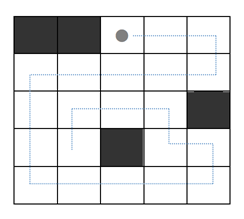

#  백준 9944 NxM 보드 완주하기


### 풀이 언어 : C++

문제 구분 : #백트래킹 #완전탐색
#### [LINK - 백준 9944 NxM 보드 완주하기](https://www.acmicpc.net/problem/9944)

### 문제
<hr>

N×M 보드 위에서 할 수 있는 게임이 있다. 보드는 크기가 1×1인 정사각형 칸으로 나누어져 있다. 보드의 각 칸은 빈 칸 또는 장애물이다. 장애물은 아래 그림에선 어두운 사각형으로 표시되어져 있다.

게임을 시작하려면 보드의 빈 칸 위에 공을 하나 놓아야 한다. 아래 그림에서 공은 회색 점으로 표시되어져 있다. 게임은 단계로 이루어져 있고, 각 단계는 아래와 같이 구성되어져 있다.

- 위, 아래, 오른쪽, 왼쪽 중 방향 하나를 고른 다음, 그 방향으로 공을 계속해서 이동시킨다.
- 공은 장애물, 보드의 경계, 이미 공이 지나갔던 칸을 만나기 전까지 계속해서 이동한다.

게임은 공이 더 이상 이동할 수 없을 때 끝난다. 이 때, 모든 빈 칸을 공이 방문한 적이 있어야 한다.

아래 그림은 총 10단계 만에 모든 칸을 방문하는 방법이다.

<center>  </center>


보드의 상태가 주어졌을 때, 모든 칸을 방문하기 위한 이동 횟수의 최솟값을 구하는 프로그램을 작성하시오.

### 입력
<hr>

입력은 여러 개의 테스트 케이스로 이루어져 있다.

각 테스트 케이스의 첫째 줄에는 보드의 크기를 나타내는 N과 M이 주어진다. N은 세로 크기, M은 가로 크기이고, 두 값은 30보다 작거나 같은 자연수이다. 둘째 줄부터 N개의 줄에는 보드의 상태가 주어진다. 보드의 상태는 장애물을 나타내는 '*'과 빈 칸을 나타내는 '.'으로 이루어져 있다.

입력으로 주어진 보드가 장애물로만 이루어진 경우는 없다.
### 출력
<hr>

각 테스트 케이스마다 보드의 모든 빈 칸을 방문하는 최소 이동 횟수를 출력한다. 출력 형식은 예제를 참고한다.

만약, 모든 빈 칸을 방문할 수 없다면 최소 이동 횟수는 -1이다. 가능한 이동 경로의 수는 1,000,000개를 넘지 않는다.
### 풀이 이야기
<hr>

이 문제는 백트래킹을 통해서 모든 경우의 수로 이동해보면서 풀어낼 수 있다. 다만, 기본적인 DFS, BFS와 다른 점은 한방향을 선택하면, 벽을 만나거나 기존 이동 경로를 만날 때 까지 방향을 바꿀 수 없다. 따라서 한 방향으로 끝까지 이동하게 해주는 함수를 4방향으로 만들고 이를 백트래킹하면서 각 방향별로 시도해보면서 해결할 수 있다.

```c++
// Solve
void solve(int x, int y, int c, int depth) {
    // 기저 사례 1: 현재 계산 값이 최적보다 많으면 PASS
    if (depth >= ret)
        return ;
    // 기저 사례 2 : 모든 빈칸을 이동한 경우
    if (c == 0) {
        ret = std::min(ret, depth);
        return ;
    }
    // 원복 지점 저장
    int sx = x;
    int sy = y;
    int c2;
    // 위로 이동 시도
    c2 = moveUp(x, y - 1, y);
    if (c2) {
        solve(x, y, c - c2, depth + 1);
        resetMoveUp(x, y, c2);
    }
    ...
}
```
위 코드는 한 방향으로 백트래킹하는 코드 중 일부이다. 먼저 기저 사례의 경우 2가지가 존재하는데, 이전에 탐색한 최적의 답보다 현재 진행 중인 답이 더 크다면 이미 최적의 해가 아니기 때문에 Return을 통해서 더 이상 탐색하지 않도록 하였다. 또한, 모든 빈칸을 이동하여 `c`의 값이 0이 되었다면 정답에 도달한 것이기 때문에 이동거리를 업데이트해주면서 탐색을 멈춘다. 이후 상, 하, 좌, 우로 이동을 시도해보면서 모든 경우에 대해 탐색하면 된다.

```c++
int moveUp(int x, int y, int &sy) {
    int cnt = 0;
    for (int i = y; i >= 0; i--) {
        if (board[i][x] == '*' || board[i][x] == 'X')
            return cnt;
        board[i][x] = 'X';
        sy = i;
        cnt += 1;
    }
    return cnt;
}
```
한 방향으로 탐색하는 부분이다. 여기서는 한칸 단위로 방향을 변경할 수 없기 때문에 한 방향을 지정해주면 `*`이나 이미 지나온 마크 `X`를 만나기 전까지 한번에 이동하도록 진행했다. 이렇게 하면 이동할 수 있는 지점이 획기적으로 줄기 때문에 시간 복잡도를 많이 줄일 수 있다.


### 풀이 코드
<hr>

``` c++
#include <iostream>
#include <vector>
#include <string>

int N, M, C, ret = 2147483647;
std::vector<std::string> board;

// 오른쪽으로 이동
int moveRight(int x, int y, int &sx) {
    int cnt = 0;
    for (int i = x; i < M; i++) {
        if (board[y][i] == '*' || board[y][i] == 'X')
            return cnt;
        board[y][i] = 'X';
        sx = i;
        cnt += 1;
    }
    return cnt;
}

// 왼쪽으로 이동
int moveLeft(int x, int y, int &sx) {
    int cnt = 0;
    for (int i = x; i >= 0; i--) {
        if (board[y][i] == '*' || board[y][i] == 'X')
            return cnt;
        board[y][i] = 'X';
        sx = i;
        cnt += 1;
    }
    return cnt;
}

// 아래로 이동
int moveDown(int x, int y, int &sy) {
    int cnt = 0;
    for (int i = y; i < N; i++) {
        if (board[i][x] == '*' || board[i][x] == 'X')
            return cnt;
        board[i][x] = 'X';
        sy = i;
        cnt += 1;
    }
    return cnt;
}

// 위로 이동
int moveUp(int x, int y, int &sy) {
    int cnt = 0;
    for (int i = y; i >= 0; i--) {
        if (board[i][x] == '*' || board[i][x] == 'X')
            return cnt;
        board[i][x] = 'X';
        sy = i;
        cnt += 1;
    }
    return cnt;
}

// 오른쪽 이동 취소
void resetMoveRight(int x, int y, int c) {
    for (int i = x; i > x - c; i--)
        board[y][i] = '.';
}

// 왼쪽 이동 취소
void resetMoveLeft(int x, int y, int c) {
    for (int i = x; i < x + c; i++)
        board[y][i] = '.';
}

// 위 이동 취소
void resetMoveUp(int x, int y, int c) {
    for (int i = y; i < y + c; i++)
        board[i][x] = '.';
}

// 아래 이동 취소
void resetMoveDown(int x, int y, int c) {
    for (int i = y; i > y - c; i--)
        board[i][x] = '.';
}

// Solve
void solve(int x, int y, int c, int depth) {
    // 기저 사례 1: 현재 계산 값이 최적보다 많으면 PASS
    if (depth >= ret)
        return ;
    // 기저 사례 2 : 모든 빈칸을 이동한 경우
    if (c == 0) {
        ret = std::min(ret, depth);
        return ;
    }
    // 원복 지점 저장
    int sx = x;
    int sy = y;
    int c2;
    // 위로 이동 시도
    c2 = moveUp(x, y - 1, y);
    if (c2) {
        solve(x, y, c - c2, depth + 1);
        resetMoveUp(x, y, c2);
    }
    y = sy; // 좌표 원복
    // 아래로 이동 시도
    c2 = moveDown(x, y + 1, y);
    if (c2) {
        solve(x, y, c - c2, depth + 1);
        resetMoveDown(x, y, c2);
    }
    y = sy; // 좌표 원복
    // 왼쪽으로 이동 시도
    c2 = moveLeft(x - 1, y, x);
    if (c2) {
        solve(x, y, c - c2, depth + 1);
        resetMoveLeft(x, y, c2);
    }
    x = sx; // 좌표 원복
    // 오른쪽으로 이동 시도
    c2 = moveRight(x + 1, y, x);
    if (c2) {
        solve(x, y, c - c2, depth + 1);
        resetMoveRight(x, y, c2);
    }
    x = sx;
}

int main(void) {
    // Input
    int idx = 1;
    std::string tmp;
    while (std::cin >> N >> M) {
        for (int i = 0 ; i < N; i++) {
            std::cin >> tmp;
            for (int j = 0; j < tmp.size(); j++) {
                if (tmp[j] == '*')
                    C += 1;
            }
            board.push_back(tmp);
        }
        // Solve
        for (int i = 0; i < N; i++) {
            for (int j = 0; j < M; j++) {
                if (board[i][j] == '*')
                    continue;
                board[i][j] = 'X';
                solve(j, i, N * M - C - 1, 0);
                board[i][j] = '.';
            }
        }
        // Print
        if (ret == 2147483647)
            ret = -1;
        std::cout << "Case " << idx << ": " << ret << std::endl;
        board.clear();
        ret = 2147483647;
        C = 0;
        idx += 1;
    }
}
```
