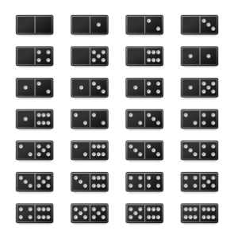

문제 구분 : #백트래킹 #완전탐색
##### [문제 - 문제 이름](https://www.acmicpc.net/problem/)

### 문제
<hr>

<center></center>

도미노의 크기는 1×2이고, 크기가 1×1인 칸으로 나누어져 있다. 칸은 수를 나타내며, 위와 같이 총 28가지가 있다.

크기가 8×7인 격자가 있고, 격자의 각 칸에는 정수가 하나씩 들어있다. 위의 도미노를 이용해 문제의 격자와 같은 상태를 만드는 방법의 수를 구해보자.

격자의 칸에 적힌 수는 도미노의 칸이 의미하는 수와 같아야 한다. 도미노는 회전할 수 있으며, 같은 도미노를 여러 번 사용하면 안된다.

### 입력
<hr>

총 8개의 줄에 격자의 상태가 주어진다. 격자에는 0부터 6까지의 수만 존재한다.
### 출력
<hr>

첫째 줄에 경우의 수를 출력한다.

### 풀이 이야기
<hr>

도미노 찾기 문제는 다른 일반적인 백트래킹 문제보다 풀이 길이가 꽤나 길었다. 이유는 다양한 변수들을 Checking하고 UnChecking하는 과정에서 코드가 늘어난 것 뿐이니 난이도 자체가 올라가서 코드양이 늘어난 것은 아니다.

먼저 풀이에서 배열의 종류가 중요한데, 도미노를 채울 격자 배열(`map`), 도미노를 사용했는지에 대한 배열(`chk`), 도미노를 채울 격자에 도미노가 놓아져 있는지 확인하는 배열(`mapchk`) 이렇게 3가지 배열을 활용 했다. 마지막 배열인 도미노가 놓아져 있는지 확인하는 배열(`mapchk`)은 격자 배열(`map`)의 값을 잘 조정해서 해결할 수 있다. 필자는 배열을 하나 더 두는 방식이 편해 이를 선택했다.

배열을 모두 정했다면, 도미노들을 놓아봐야한다. 도미노를 현재 위치에서 두는 방식은 다음과 같다. 

- 가로로 둔다.
- 세로로 둔다.

이 때 가로로 두는 경우 재귀호출을 2칸을 넘어가는 방식으로 조금 더 효율적으로 풀이할 수 있다. 이 때문에 코드를 살펴보면 가로로 도미노를 두는 경우에만 `cnt` 값이 2 증가하는 것을 확인 할 수 있다. 두 방식 모두 Index에 주의하면서 남은 도미노에서 놓을 수 있는지만 확인해주면 된다. 다만 여기서 중요한 부분은 **도미노를 회전할 수 있다는 조건**이다. 도미노를 회전할 수 있다는 말은 $(3, 4)$ 도미노를 $(4, 3)$과 같이 180도 회전해서 가로로 둘 수 있다는 것이다. 세로도 마찬 가지이다. 

따라서 놓을 위치에 2가지 숫자가 있다면, 사용할 도미노를 판단하기 위해서 오름차순이나 내림차순으로 반드시 정렬하여 체킹을 이어가야한다. 즉, $(3, 4)$와 $(4, 3)$이 같은 경우라고 생각해야한다는 뜻이다. 왜냐면 도미노는 돌려서 사용할 수 있지만, $(3, 4)$ 도미노는 단 1개이기 때문이다. 따라서 도미노를 사용했는지 체크하는 부분에서는 작은 수를 L, 큰 수를 R로 고정하여 체킹을 했다. 작은 수를 R로 두어도 상관은 없다.

마지막으로, 가로로도, 세로로도 놓을 수 없는 경우가 있다. 이는 바로 **이미 도미노가 놓여져 있는 자리**이다. 이는 순차적으로 도미노를 놓는다고 하더라도, 세로로 놓는 방향 때문에 생기는 경우이다. 따라서 필자는 `Flag` 변수를 통해서 도미노를 놓지 못하는 상황에서만 자연스럽게 다음으로 PASS하는 행위를 추가 했다. 단지 도미노를 놓지 못한다고 `Return`을 해버리면 세로로 둬야하는 상황에서 기저 사례( **마지막 지점 도달** )까지 도착하지 못할 수 있다.


### 풀이 코드
<hr>

``` c++
#include <iostream>
#include <string>
#include <vector>

std::vector<std::string> map; // 도미노를 채울 격자
std::vector<std::vector<bool>> chk; // 사용 도미노 체킹 배열
std::vector<std::vector<bool>> mapchk; // Map 사용 체킹 배열 
int ret; // 출력 변수

void solve(int cnt, int fillcnt) {
    // 기저 사례 : 마지막 지점 도달 시
    if (cnt == 8 * 7) {
        // 모든 칸이 도미노로 차있다면
        if (fillcnt == 8 * 7)
            ret += 1; // 결과 + 1
        return ;
    }
    // 1차원 Index -> 2차원 좌표
    int x = cnt % 7;
    int y = cnt / 7;
    bool flag = true; // 도미노를 놓아봤는지에 대한 Flag
    // 가로로 놓기
    if (x + 1 < 7) {
        // 도미노 결정 (L은 항상 작고 R은 항상 큼)
        int r = std::max(map[y][x] - '0', map[y][x + 1] - '0');
        int l = std::min(map[y][x] - '0', map[y][x + 1] - '0');
        // 미사용 도미노 + 놓을 자리가 모두 빈칸
        if (!chk[l][r] && !mapchk[y][x] && !mapchk[y][x + 1]) {
            flag = false; // 도미노를 놓았음
            // 도미노 위치 Map상 체크
            mapchk[y][x] = true;
            mapchk[y][x + 1] = true;
            chk[l][r] = true; // 도미노 사용 체크
            solve(cnt + 2, fillcnt + 2); // 다음으로 넘어감
            // 사용 원복
            mapchk[y][x] = false;
            mapchk[y][x + 1] = false;
            chk[l][r] = false;
        }
    }
    // 세로로 놓기
    if (y + 1 < 8) {
        // 도미노 결정 (L은 항상 작고 R은 항상 큼)
        int r = std::max(map[y][x] - '0', map[y + 1][x] - '0');
        int l = std::min(map[y][x] - '0', map[y + 1][x] - '0');
        // 미사용 도미노 + 놓을 자리가 모두 빈칸
        if (!chk[l][r] && !mapchk[y][x] && !mapchk[y + 1][x]) {
            flag = false; // 도미노를 놓았음
            // 도미노 위치 Map상 체크
            mapchk[y][x] = true;
            mapchk[y + 1][x] = true;
            chk[l][r] = true; // 도미노 사용 체크
            solve(cnt + 1, fillcnt + 2); // 다음으로 넘어감
            // 사용 원복
            mapchk[y][x] = false;
            mapchk[y + 1][x] = false;
            chk[l][r] = false;
        }
    }
    // 만약 도미노를 하나도 못놓았다면 PASS
    if (flag)
        solve(cnt + 1, fillcnt);
}

int main(void) {
    // Input
    for (int i = 0; i < 8; i++) {
        std::string tmp;
        std::cin >> tmp;
        map.push_back(tmp);
    }
    for (int i = 0; i < 7; i++) {
        std::vector<bool> tmp;
        for (int j = 0; j < 7; j++)
            tmp.push_back(false);
        chk.push_back(tmp);
    }
    for (int i = 0; i < 8; i++) {
        std::vector<bool> vtmp;
        for (int j = 0; j < 7; j++)
            vtmp.push_back(false);
        mapchk.push_back(vtmp);
    }
    // Solve
    solve(0, 0);
    // Print
    std::cout << ret << std::endl;
}
```
